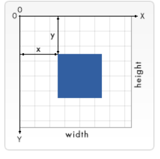

#    H5 开发设计

**新特性**

1. H5 新增标签
   
   > HTML5 定了 8 个新的 HTML 语义（semantic） 元素。-所有这些元素都是 块级 元素。为了能让旧版本的浏览器正确显示这些元素，你可以设置 CSS 的 display 属性值为 block（H5的某些标签，功能，在比较老旧的浏览器中无法正确解析执行）   

```html
header, section, footer, aside, nav, main, article, figure {
    display: block;
}
```

2. H5 自定义标签元素

> 在H5中可以自定义元素标签，如果直接写标签，此时标签是没有样式的（原本HTML中的标签的样式都是预先定义的）


## Canvas标签

> HTML5 <canvas> 元素用于图形的绘制，通过脚本 (通常是JavaScript)来完成.
>
> <canvas> 标签只是图形容器，您必须使用脚本来绘制图形。
>
> 你可以通过多种方法使用 canvas 绘制路径,盒、圆、字符以及添加图像。


### canvas元素

> `<canvas>` 看起来和 `` 标签一样，只是 `<canvas>` 只有两个可选的属性 `width、heigth` 属性，而没有 `src、alt` 属性。
>
> 如果不给 `<canvas>` 设置 `widht、height` 属性时，则默认 `width`为300、`height` 为 150，单位都是 `px`。也可以使用 `css` 属性来设置宽高，但是如宽高属性和初始比例不一致，他会出现扭曲。所以，建议永远不要使用 `css` 属性来设置 `<canvas>` 的宽高。


**注意，有些比较老的浏览器不能解析canvas标签**

```
// 若浏览器可以解析canvas标签，就会创建一个画布而忽略其中的内容，如果不能解析，就会展示标签中的内容
<canvas>
    你的浏览器不支持 canvas，请升级你的浏览器。
</canvas>
```

### 绘制形状

#### 1.栅格和坐标空间

> `canvas` 元素默认被网格所覆盖。通常来说网格中的一个单元相当于 `canvas` 元素中的一像素。栅格的起点为左上角，坐标为 (0,0) 所有元素的位置都相对于原点来定位。所以图中蓝色方形左上角的坐标为距离左边（X 轴）x 像素，距离上边（Y 轴）y 像素，坐标为 (x,y)。



------


#### 2.绘制矩形

`<canvas>` 只支持一种原生的图形绘制：**矩形**。所有其他图形都至少需要生成一种路径 (`path`)。不过，我们拥有众多路径生成的方法让复杂图形的绘制成为了可能。

canvast 提供了三种方法绘制矩形：

- 1、**fillRect(x, y, width, height)**：绘制一个填充的矩形。
- 2、**strokeRect(x, y, width, height)**：绘制一个矩形的边框。
- 3、**clearRect(x, y, widh, height)**：清除指定的矩形区域，然后这块区域会变的完全透明。

**说明：**这 3 个方法具有相同的参数。

- **x, y**：指的是矩形的左上角的坐标。(相对于canvas的坐标原点)
- **width, height**：指的是绘制的矩形的宽和高。


#### 3. 绘制路径

图形的基本元素是路径。

路径是通过不同颜色和宽度的线段或曲线相连形成的不同形状的点的集合。

一个路径，甚至一个子路径，都是闭合的。

使用路径绘制图形需要一些额外的步骤：

1. 创建路径起始点
2. 调用绘制方法去绘制出路径
3. 把路径封闭
4. 一旦路径生成，通过描边或填充路径区域来渲染图形。

**下面是需要用到的方法：**

1. `beginPath()`

   新建一条路径，路径一旦创建成功，图形绘制命令被指向到路径上生成路径

2. `moveTo(x, y)`

   把画笔移动到指定的坐标`(x, y)`。相当于设置路径的起始点坐标。**如果不设置起始点则不会绘制图形**

3. `closePath()`

   闭合路径之后，图形绘制命令又重新指向到上下文中，**用于闭合图形**

4. `stroke()`

   通过线条来绘制图形**轮廓**，**默认不会闭合图形，需要搭配closePath方法一起使用**

5. `fill()`

   通过填充路径的内容区域生成**实心的图形**，**默认闭合图形**

6. `ctx.lineTo(x, y)`

   绘制一条从当前位置到指定坐标(200, 50)的直线，**绘制直线后，画笔会自动到指定的坐标，该点作为新起始点**


#### 4.fill() 与 stroke() 的区别

+ fill（）方法为填充图形，stroke（） 方法为绘制图形的轮廓
+ fill（） 方法默认闭合图形，stroke（）方法需要搭配closePath（） 方法一起使用
+ 当我们只绘制一条线段时，fill方法无法填充，但是stroke方法可以绘制出该线段的轮廓


#### 5.绘制圆弧

**arc绘制圆弧**

1、**arc(x, y, r, startAngle, endAngle, anticlockwise)**: 以`(x, y)` 为圆心，以`r` 为半径，从 `startAngle` 弧度开始到`endAngle`弧度结束。`anticlosewise` 是布尔值，`true` 表示逆时针，`false` 表示顺时针(默认是顺时针)。

注意：

1. 这里的度数都是弧度。

2. **0 弧度是指的 x 轴正方向。**

   ```
   radians=(Math.PI/180)*degrees   //角度转换成弧度
   ```

**arcTo绘制圆弧**

2、**arcTo(x1, y1, x2, y2, radius)**: 根据给定的控制点和半径画一段圆弧，最后再以直线连接两个控制点。

> `arcTo` 方法的说明：
>
> 这个方法可以这样理解。绘制的弧形是由两条切线所决定。
>
> 第 1 条切线：起始点和控制点1决定的直线。
>
> 第 2 条切线：控制点1 和控制点2决定的直线。

#### 6.样式与颜色

 在前面的绘制矩形章节中，只用到了默认的线条和颜色。

 如果想要给图形上色，有两个重要的属性可以做到。

1. `fillStyle = color` 设置图形的填充颜色
2. `strokeStyle = color` 设置图形轮廓的颜色

**备注：**

- 1. color 可以是表示 css 颜色值的字符串、渐变对象或者图案对象。
- 2. 默认情况下，线条和填充颜色都是黑色。
- 3. 一旦您设置了 strokeStyle 或者 fillStyle 的值，那么这个新值就会成为新绘制的图形的默认值。如果你要给每个图形上不同的颜色，你需要重新设置 fillStyle 或 strokeStyle 的值。

##### line Style

**线宽**：只能是正值。默认是 1.0。

起始点和终点的连线为中心，**上下各占线宽的一半**。

```js
ctx.beginPath();
ctx.moveTo(10, 10);
ctx.lineTo(100, 10); 
ctx.lineWidth = 10;
ctx.stroke();


ctx.beginPath(); 
ctx.moveTo(110, 10); 
ctx.lineTo(160, 10)
ctx.lineWidth = 20;
ctx.stroke()
```

#####  lineCap = type

**线条末端样式**

共有 3 个值：

1. `butt`：线段末端以方形结束

2. `round`：线段末端以圆形结束

3. `square`：线段末端以方形结束，但是增加了一个宽度和线段相同，高度是线段厚度一半的矩形区域。

   ```js
   var lineCaps = ["butt", "round", "square"];
    
   for (var i = 0; i < 3; i++){
       ctx.beginPath();
       ctx.moveTo(20 + 30 * i, 30);
       ctx.lineTo(20 + 30 * i, 100);
       ctx.lineWidth = 20;
       ctx.lineCap = lineCaps[i];
       ctx.stroke();
   }
    
   ctx.beginPath();
   ctx.moveTo(0, 30);
   ctx.lineTo(300, 30);
    
   ctx.moveTo(0, 100);
   ctx.lineTo(300, 100)
    
   ctx.strokeStyle = "red";
   ctx.lineWidth = 1;
   ctx.stroke();
   ```

   

#### 7.绘制文本

1. `fillText(text, x, y [, maxWidth])` 在指定的 (x,y) 位置填充指定的文本，绘制的最大宽度是可选的。
2. `strokeText(text, x, y [, maxWidth])` 在指定的 (x,y) 位置绘制文本边框，绘制的最大宽度是可选的

#### 8.绘制图片

我们也可以在 `canvas` 上直接绘制图片。

##### 8.1 由零开始创建图片


var img = new Image();   // 创建一个元素 img.src = 'myImage.png'; // 设置图片源地址

脚本执行后图片开始装载。

**绘制 `img`**

```js
// 参数 1：要绘制的 img  
// 参数 2、3：绘制的 img 在 canvas 中的坐标
ctx.drawImage(img,0,0); 
```

**注意**：考虑到图片是从网络加载，如果 `drawImage` 的时候图片还没有完全加载完成，则什么都不做，个别浏览器会抛异常。所以我们应该保证在 `img` 加载完成之后再 `drawImage`。

```js
var img = new Image();   
// 创建img元素 
img.src = 'myImage.png'; // 设置图片源地址
img.onload = function(){  
ctx.drawImage(img, 0, 0)
} 
 
```


##### 8.2 绘制 `img` 标签元素中的图片

`img` 可以 `new` 也可以来源于我们页面的 ``标签。

第一张图片就是页面中的 `` 标签：

##### 8.3 缩放图片

`drawImage()` 也可以再添加两个参数：

```
drawImage(image, x, y, width, height)
```

这个方法多了 2 个参数：`width` 和 `height`，这两个参数用来控制 当像 canvas 画入时应该缩放的大小。

```js
ctx.drawImage(img, 0, 0, 400, 200)
```


## SVG

### svg简介

>   什么是SVG？
>
> SVG 指可伸缩矢量图形 (Scalable Vector Graphics)
>
> SVG 用来定义用于网络的基于矢量的图形
>
> SVG 使用 XML 格式定义图形
>
> SVG 图像在放大或改变尺寸的情况下其图形质量不会有所损失
>
> SVG 与诸如 DOM 和 XSL 之类的 W3C 标准是一个整体
>
> 
>
> SVG 的历史和优势
>
> 在 2003 年一月，SVG 1.1 被确立为 W3C 标准。
>
> 
>
> 参与定义 SVG 的组织有：Sun公司（已被Oracle公司收购）、Adobe、苹果公司、IBM 以及柯达。
>
> 
>
> 与其他图像格式相比，使用 SVG 的优势在于：
>
> 
>
> SVG 可被非常多的工具读取和修改（比如记事本）
>
> SVG 与 JPEG 和 GIF 图像比起来，尺寸更小，且可压缩性更强。
>
> SVG 是可伸缩的
>
> SVG 图像可在任何的分辨率下被高质量地打印
>
> SVG 可在图像质量不下降的情况下被放大
>
> SVG 图像中的文本是可选的，同时也是可搜索的（很适合制作地图）
>
> SVG 可以与 Java 技术一起运行
>
> SVG 是开放的标准
>
> SVG 文件是纯粹的 XML
>
> SVG 的主要竞争者是 Flash。
>
> 
>
> 与 Flash 相比，SVG 最大的优势是与其他标准（比如 XSL 和 DOM）相兼容。而 Flash 则是未开源的私有技术。
>
> 
>
> 查看 SVG 文件
>
> Internet Explorer9，火狐，谷歌Chrome，Opera和Safari都支持SVG。
>
> 
>
> IE8和早期版本都需要一个插件 - 如Adobe SVG浏览器，这是免费提供的。
>
> 
>
> 创建SVG文件
>
> 由于SVG是XML文件，SVG图像可以用任何文本编辑器创建，但它往往是与一个绘图程序一起使用，如Inkscape，更方便地创建SVG图像。

###  SVG 与 Canvas两者间的区别

SVG 是一种使用 XML 描述 2D 图形的语言。

Canvas 通过 JavaScript 来绘制 2D 图形。

SVG 基于 XML，这意味着 SVG DOM 中的每个元素都是可用的。您可以为某个元素附加 JavaScript 事件处理器。

在 SVG 中，每个被绘制的图形均被视为对象。如果 SVG 对象的属性发生变化，那么浏览器能够自动重现图形。

Canvas 是逐像素进行渲染的。在 canvas 中，一旦图形被绘制完成，它就不会继续得到浏览器的关注。如果其位置发生变化，那么整个场景也需要重新绘制，包括任何或许已被图形覆盖的对象。

## MathML简介

MathML指“数学标记语言”，是XML语言的一个子集，用来在web网页，甚至部分软件中显示数学公式。

简言之，就是使用特殊的类似HTML的标记在网页中显示数学公式。

因为有些数学公式很复杂，普通HTML根本没法驾驭,所以引进MathML


 

1. 按类别分类的MathML表现元素

### 顶级元素 

<math>

用在最外部包裹，表示里面的都是数学公式。例如，就一个变量x，则有：

```
<math>
  <mi>x</mi>
</math>
```

效果是： x


mi是’math identifier’的缩写，字面意思数学标识符，多指函数名，变量或者符号常量。注意（下面标识符之间无任何关联，仅仅示意语义）：

<math> 
  <mi> y </mi>  
  <mi> sin </mi>
  <mi mathvariant="monospace"> x </mi>
  <mi mathvariant="bold"> &pi; </mi>
</math>
效果是： y sin x π

<mn>

mn是’math number’的缩写，表示数值，支持各种数值。示意（仅示意，无关联）：

```html
<math> 
  <mn> 0 </mn>
  <mn> 1.337 </mn>
  <mn> twelve </mn>
  <mn> XVI </mn>     
  <mn> 2e10 </mn> 
</math>
```

效果是： 0 1.337 twelve XVI 2e10

<mo>

mo是’math operators’的缩写，表示数学操作符，例如加减乘除，各种括号，分号等。示意：

```html
<math>
<mrow>
  <mn>5</mn>
  <mo>+</mo>
  <mn>5</mn>
</mrow> 

<mrow>
  <mo> [ </mo> 
  <mrow>
    <mn> 0 </mn>
    <mo> ; </mo> 
    <mn> 1 </mn>
  </mrow>
  <mo> ) </mo>
</mrow>
</math>
```

效果是： 5 + 5 [ 0 ; 1 )

<ms>

ms是’math string literal’的缩写，表示一个字符串文字，这个字符串需要由编程语言和计算机代数系统来解释。默认情况下，字符串文字显示为用双引号括起来（&quot;）; 通过使用lquote和rquote属性，您可以设置要显示的自定义字符。示意：

```html
<math>
  <ms lquote="„" rquote="“"> abc </ms>
</math>
```

效果是： abc

<mspace>

mspace是’math space’的缩写，表示空白间距，其尺寸可以通过width, height以及depth等尺寸控制。示意：

```html
<math>
  <mi>x</mi>
  <mspace width="40px"></mspace>
  <mi>y</mi>
</math>
```

效果是： x y

<mtext>

MathML <mtext>元素用于呈现没有符号含义的任意文本，例如注释或注解。示意：

```xml
<math> 
  <mtext> 毕达哥拉斯定理 </mtext>  
  <mtext> /* 在这里注释 */ </mtext>
</math>
```

https://webdemo.myscript.com/views/math/index.html


## 拖放
HTML5提供专门的拖拽与拖放的API，以后实现这类效果就不必乱折腾了。但是，考虑到Opera浏览器似乎对此不感冒，在通用性上有待商榷，所以这里也就简单说一说。

兼容性： 
不支持IE9

1. 基本api的介绍
2. 拖拽的小demo 进行分组
3. 使用拖拽进行删除
4. 拖拽进行文件上传，并以base64文件格式上传后端服务器
5. 在vue项目中使用 Vue-Draggable插件进行拖拽分组

https://segmentfault.com/a/1190000012945944
https://www.cnblogs.com/yehuisir/p/13533234.html


## 相关重点

#### DataTransfer 对象：拖拽对象用来传递的媒介，使用一般为Event.dataTransfer。

DataTransfer 对象用于保存拖动并放下（drag and drop）过程中的数据。它可以保存一项或多项数据，这些数据项可以是一种或者多种数据类型。
dataTransfer对象提供了一些方法用于在源元素与目标元素中共享数据
 方法
       - setData(type,data):用于声明所发送的数据与类型
              - getData(type): 返回指定type的数据
              - clearData(type):删除指定类型的数据

event.dataTransfer.setDragImage(p_w_picpath,x,y);
- setDragImage方法用于在拖放操作过程中，修改鼠标指针所指向的图像

#### draggable 属性：就是标签元素要设置draggable=true，否则不会有效果，例如
```
<div title="拖拽我" draggable="true">列表1</div>
```
拖放是 HTML5 中非常常见的功能。

注意： 为了让元素可拖动，需要使用 HTML5 draggable 属性。
>提示： 链接和图片默认是可拖动的，不需要 draggable 属性。

在拖放的过程中会触发以下事件：

#### 在拖动目标上触发事件 (源元素) ,作用在被拖曳元素上:
ondragstart - 用户开始拖动元素时触发
ondrag - 元素正在拖动时触发
ondragend - 用户完成元素拖动后触发

#### 释放目标时触发的事件,作用在目标元素上:

- ondragenter - 进入其容器范围内触发
当被鼠标拖动的对象进入其容器范围内时触发此事件

- ondragover - 被拖动的对象在另一对象容器范围内拖动
当某被拖动的对象在另一对象容器范围内拖动时触发此事件

- ondragleave  - 拖动的对象离开其容器范围内时触发
当被鼠标拖动的对象离开其容器范围内时触发此事件

- ondrop - 释放鼠标键时触发
在一个拖动过程中，释放鼠标键时触发此事件


####  Event.preventDefault() 方法：

阻止默认的些事件方法等执行。在ondragover中一定要执行preventDefault()，否则ondrop事件不会被触发。

另外，如果是从其他应用软件或是文件中拖东西进来，尤其是图片的时候，默认的动作是显示这个图片或是相关信息，并不是真的执行drop。此时需要用用document的ondragover事件把它直接干掉。

1. 拖拽的基本用法
2. 拖拽的demo

 

## H5地理位置

### 地理信息

1. 定位用户的位置，使用HTML5 Geolocation API用于获得用户的位置
2. 但是必须要获取用户的同意，否则不行!
3. 主要使用**navigator.geolocation.getCurrentPosition(success, error, options)**

```
<!DOCTYPE html>
<html lang="en">
<head>
    <meta charset="UTF-8">
    <title>Title</title>
</head>
<body>
<script>
    if (navigator.geolocation) {
        navigator.geolocation.getCurrentPosition(function(position) {
            const {longitude,latitude,accuracy,altitude,altitudeAccuracy,heading,speed} = position.coords
            // 参数分析
            // longitude 经度
            // latitude 纬度
            // accuracy 准确度
            // altitude 海拔
            // altitudeAccuracy 海拔准确度
            // heading 行进方向
            // speed 地面速度
            // position.timestamp 请求的时间
            console.log(position)
        }, function (error) {
            // error.code
            // 0: 不包括其它错误编号中的错误
            // 1: 用户拒绝获取位置信息
            // 2: 尝试获取用户信息，但是失败了
            // 3: 设置了timeout，获取位置超时了
            alert(error.message)
        }, {
            enableHighAccuracy: false, // 位置是否精确获取
            timeout: 8000, // 获取位置允许的最长时间，默认为infinity
            maximumAge: 1000 // 多久更新获取一次位置，位置可以缓存的最大时间，默认为0
        })
    } else {
        alert("你的浏览器不支持Geolocation，建议升级")
    }
</script>
</body>
</html>

```

### 重复性位置更新请求

**navigator.geolocaton.watchPosition(请求成功,请求失败,数据收集方式)**
这个只会在移动设备上有用，位置改变才会触发
配置参数：frequency更新的频率
使用clearWatch关闭更新请求
百度地图api：http://lbsyun.baidu.com/
高德地图api：http://lbs.amap.com/


 


## 6 Web存储

随着互联网的快速发展，基于网页的应用越来越普遍，同时也变的越来越复杂，为了满足各种各样的需求，会经常性在本地存储大量的数据，HTML5规范提出了相关解决方案。

### 6.1 特性

1、设置、读取方便、页面刷新不丢失数据

2、容量较大，sessionStorage约5M、localStorage约20M

4、只能存储字符串，可以将对象JSON.stringify() 编码后存储

### 6.2 window.sessionStorage

1、生命周期为关闭浏览器窗口

2、在同一个窗口(页面)下数据可以共享

### 6.3 window.localStorage

1、永久生效，除非手动删除 关闭页面也会存在

2、可以多窗口（页面）共享（同一浏览器可以共享）

### 6.4 方法详解

setItem(key, value) 设置存储内容

getItem(key) 读取存储内容

removeItem(key) 删除键值为key的存储内容

clear() 清空所有存储内容

### 6.5 其它

WebSQL、IndexDB

## 7 应用缓存

HTML5中我们可以轻松的构建一个离线（无网络状态）应用，只需要创建一个cache manifest文件。

### 7.1 优势

1、可配置需要缓存的资源

2、网络无连接应用仍可用

3、本地读取缓存资源，提升访问速度，增强用户体验

4、减少请求，缓解服务器负担

### 7.2 缓存清单

一个普通文本文件，其中列出了浏览器应缓存以供离线访问的资源，推荐使用.appcache为后缀名

例如我们创建了一个名为demo.appcache的文件，然后在需要应用缓存在页面的根元素(html)添加属性manifest="demo.appcache"，路径要保证正确。

### 7.3 manifest文件格式*

1、顶行写CACHE MANIFEST

2、CACHE: 换行 指定我们需要缓存的静态资源，如.css、image、js等

3、NETWORK: 换行 指定需要在线访问的资源，可使用通配符

4、FALLBACK: 换行 当被缓存的文件找不到时的备用资源


### 7.4 其它

1、CACHE: 可以省略，这种情况下将需要缓存的资源写在CACHE MANIFEST

2、可以指定多个CACHE: NETWORK: FALLBACK:，无顺序限制

3、#表示注释，只有当demo.appcache文件内容发生改变时或者手动清除缓存后，才会重新缓存。

4、chrome 可以通过chrome://appcache-internals/工具和离线（offline）模式来调试管理应用缓存


## 音视频

### 1、video标签的作用

video标签时用来定义视频播放器的，而且他还可以实现自定义播放、暂停、进度和控制等控制栏的功能

video标签的使用方法，如下：

 

```

<video src = "视频文件路径" controls>你的浏览器不支持video标签</video>

/*其中src时video的基本属性用于存放视频文件路径，
而controls是video标签提供的一套默认的控制栏功能，
其中包含了播放、暂停、进度和控制等功能，
而video标签中包含的文字是用于浏览器不支持时显示的
*/
```

这里为了让尽量多的浏览器都能显示出video标签我们使用这样的语法

```
<video controls>
	<source src = "视频文件路径" type = "video/格式">
	<source src = "视频文件路径" type = "video/格式">
	...
</video>
```


通过在video中使用更多的视频格式，从而兼容更多的浏览器

### 2、video标签用于视频播放的常用属性

| 属性     | 允许取的值           | 取值的说明                                                   |
| -------- | -------------------- | ------------------------------------------------------------ |
| autoplay | autoplay             | 如果出现了该属性，则视频在缓冲就绪后马上播放                 |
| controls | controls             | 如果出现了该属性，则向用户显示控件，比如播放按钮             |
| height   | px（多少像素）、100% | 设置视频播放器的高度                                         |
| width    | px（多少像素）、100% | 设置视频播放器的宽度                                         |
| loop     | loop                 | 如果出现该属性，则当媒体文件播放完后再次播放（循环播放）     |
| preload  | preload              | 如果出现该属性，则视频在页面加载时进行加载，并预备播放。如果使用了autoplay，则忽略该属性） |
| src      | 视频文件的路径       | 视频文件的路径                                               |

### 3、video对象的常用方法


| 方法          | 方法描述                                                     |
| ------------- | ------------------------------------------------------------ |
| load()        | 该方法用于加载视频文件，为播放做准备。常用于播放前的预加载，也会用于重新加载媒体文件 |
| play()        | 用于播放视频文件。如果视频没有加载，则加载并播放；如果视频时暂停的，则变为播放 |
| pause()       | 暂停视频                                                     |
| canPlayType() | 测试浏览器是否支持指定的视频类型                             |


4、video对象的常用属性

| 属性           | 属性描述                                       |
| -------------- | ---------------------------------------------- |
| currentSrc     | 返回当前视频文件的地址                         |
| currentTime    | 设置或者返回视频中的当前播放位置（以秒为单位） |
| duration       | 返回视频的长度（以秒为单位）                   |
| ended          | 返回视频的播放是否以及结束                     |
| error          | 返回视频错误状态的MediaError对象               |
| paused         | 设置或者返回视频是否暂停                       |
| muted          | 设置或者返回视频是否关闭声音                   |
| volume         | 设置或者返回视频的音量大小                     |
| height / width | 设置或者返回视频的高度值 / 宽度值              |

