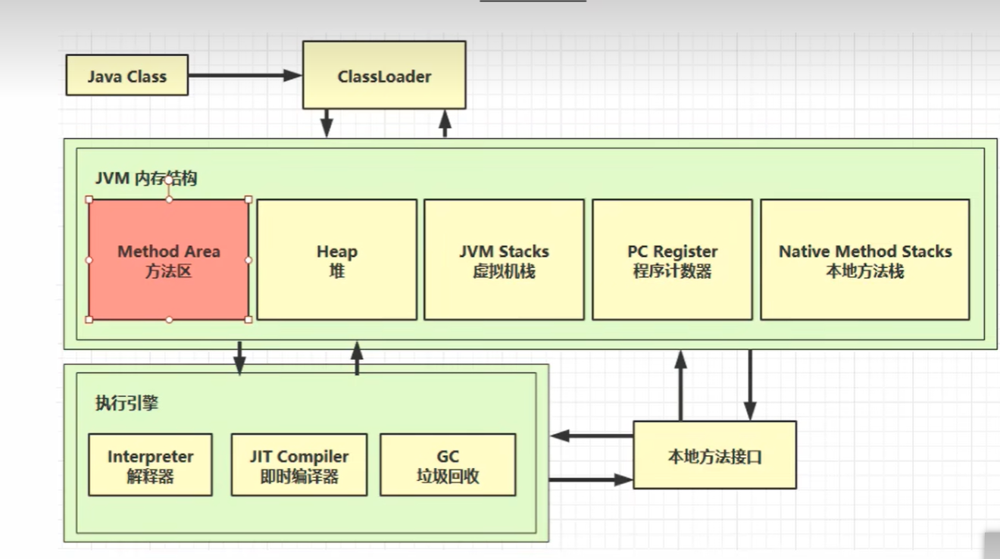
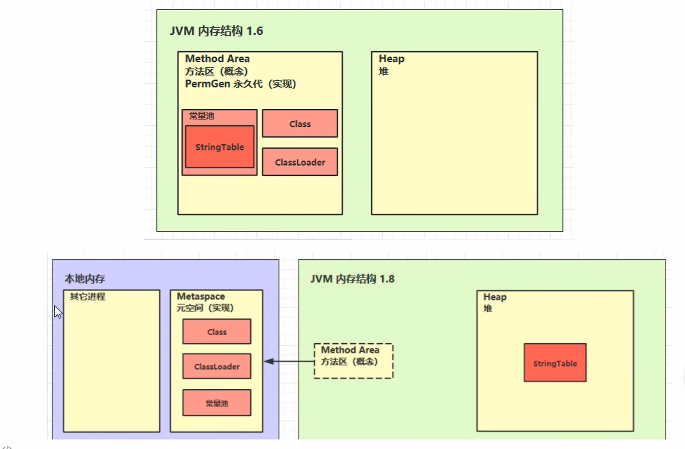
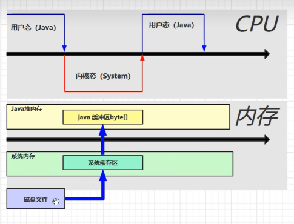
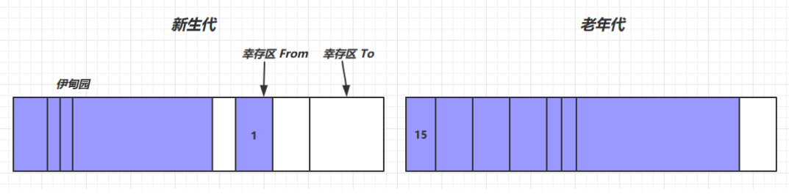
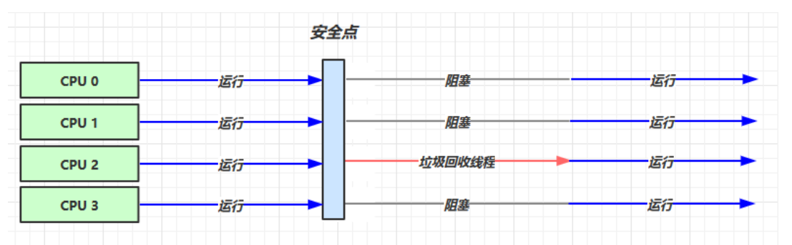
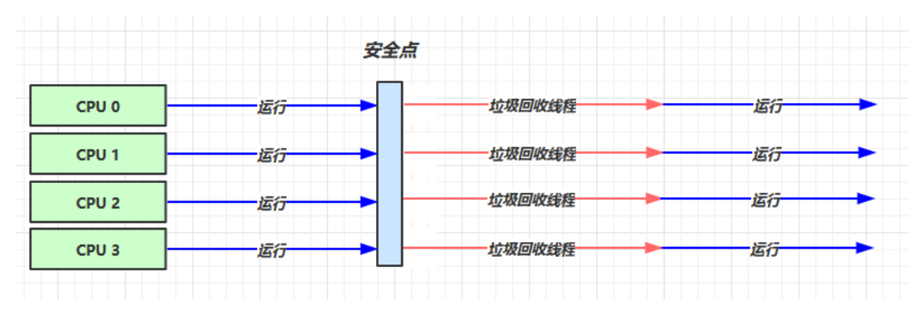
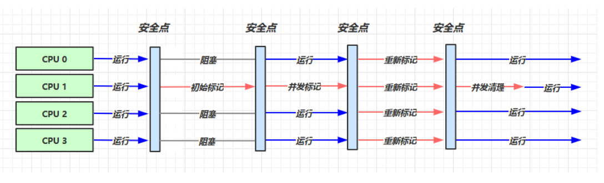

# JVM

## 内存结构



### 1. 程序计数器

+ 程序计数器 是计算机概念上的东西 , 在物理实现上是通过 寄存器来实现的
+ 作用 : 记住下一条jvm 指令的执行地址
+ 特点
  + 线程私有 , 每个线程都有单独的程序计数器 , 如果线程销毁 程序计数器也会随之销毁
  + 程序计数器是一个比较小的内存空间
  + 不会存在内存溢出

### 2. Java 虚拟机栈

+ 每个线程运行时所需要的内存 ,  称为 虚拟机栈
+ 每个栈 由多个栈帧 ( Frame )组成 , 对应着每个方法调用时所占据的内存
+ 每个线程 都有单独使用的栈 ,  每个栈中 **正在运行**的 方法对应的栈帧 称为 **活动栈帧**  , 活动栈帧只有一个 


**问题辨析**

1. 垃圾回收机制回收内存时会涉及到 栈内存吗
   + 不会 , 垃圾回收机制涉及的是堆内存 , 栈内存中存放 的都是局部变量 方法参数等等方法执行完成之后就会被释放掉  所以不会涉及 垃圾回收
2. 栈内存分配越大越好吗
   + 不是越大越好 , 合理即可
   + 如果栈内存分配过大会导致  并发执行的线程数减少
   + 栈内存中主要存放方法参数 和 局部变量所以不需要 太大的内存空间 , 分配过大会导致 内存 利用率不高
3. 方法内的局部变量是否线程安全
   + 方法内的局部变量是不会存在 线程安排问题的 因为 各个线程 执行方法的时候都会创建新的 局部变量 , 最主要的是 这些局部变量是 不共享的
   + 如果方法的参数 是一个对象 或者  方法 的返回值是一个对象  那么 这些 对象或者 引用了这些对象的变量都会存在线程安全问题


**栈内存溢出**

1. 栈内存中栈帧数量过多 ,( 递归调用的时候  会产生大量的方法调用 就会有 大量的 栈帧产生 )
2. 栈内存中的 栈帧过大 ,  即某个方法中的变量占用的内存太大( 查询的数据量过大 等)


**技巧案例**

定位CPU占用过多的程序

1. 使用 top 指令定位到 哪个进程对 cpu  的占用过高
2.  ps H -eo pid , tip , %cpu | grep 进程id ( 用 ps 命令 进一步 定位是哪个线程引起的 cpu 占用过高)


Jstack 进程 id : 可以根据线程 id 找到有问题的进程  , 进一步定位到问题代码 的源代码

### 3. 本地方法栈

> - Java[虚拟机](https://so.csdn.net/so/search?q=虚拟机&spm=1001.2101.3001.7020)栈用于管理Java方法的调用，而本地方法栈用于管理本地方法的调用。
> - 本地方法栈，也是线程私有的。
> - 允许被实现成固定或者是可动态扩展的[内存](https://so.csdn.net/so/search?q=内存&spm=1001.2101.3001.7020)大小。(在内存溢出方面是相同的)


### 4. Heap 堆

+ 通过 new 关键字 创建的对象 都会存储在堆内存中
+ 堆内存是线程共享的 , 所以 堆内存中的对象都需要考虑线程安全问题
+ 堆内存中存在垃圾回收机制


**堆内存诊断方法**

+ jps 命令
  + 查看当前系统中 有哪些 java 进程 可以查看到进程id
+ jmap 命令
  + 查看 堆内存的占用情况 jmap - heap  + 进程id ( 快照方式 )
+ jconsole mingl
  + 图形界面 多功能的检测工具 , 可以连续监测
+ jvirsualvm


### 5. 方法区

#### **方法区内存结构图**

> 在JDK 6时 是使用的是永久代内存实现的 此内存大小比较小
>
> 在JDK 7以前，习惯上把方法区称为永久代（习惯上），而到了JDK8，终于完全废弃了永久代的概念，改用本地内存中实现的元空间（Metaspace）来代替。
>
> 这两个最大的区别就是：**元空间不在虚拟机设置的内存中，而是使用本地内存。**




**当方法区出现内存溢出时   jdk8 会导致元空间内存溢出 jdk6会导致永久代内存溢出**


#### 运行时常量池

> 常量池 就是一张 哈希表 , 虚拟机指令根据这张常量表找到要执行的类名,方法名,参数类型, 字面量等信息
>
> 运行时常量池, 常量池时 .class 文件中的 当该类被加载 , 它的常量池信息就会放入到运行时常量池 , 并将里面的符号地址变成真实的地址
>
> 根据上面的信息可以看到 一个类编译之后这个类的信息就会被存储到常量池中 , 当运行到这个类的时候就会将这个类的信息加载到 运行时常量池


#### StringTable特性

+ 常量池中的字符串仅是符号, 第一次用到的时候才会变成对象
+ 利用串池的机制, 来避免重复闯进啊字符串对象 ( 这里的字符串对象都是常量值 , 存放在 字符串常量池中)
  + 每次创建字符串常量时 都会先去StringTable这张表中查找 看看是否有这个字符串常量 
  + 如果有直接引用 , 如果没有 就创建字符串对象放到 StringTable中并引用
+ 字符串变量拼接的原理是 StringBuilder (1.8)
  + ```String S = S1 + S2; -> new StringBuilder().append("a").append("b").toString()  new String(StringBuilder()得到的值) 返回给 s ```
+ 字符串常量拼接 不会在 堆内存中创建对象 而是 先检查字符串常量池中是否有 拼接之后的字符串对象 如果有直接引用 如果没有就创建字符串对象放在 字符串常量池中
+ 可以使用 s.intern() 方法 主动将串池中还没有的字符串对象 放入到串池中
  + 1.8 将这个字符串对象尝试放入到串池中 , 如果有则不会放入 如果没有则放入串池   之后返回串池中的字符串对象的地址
  + 1.6 将这个字符串对象尝试放入到串池中 , 如果有则不会放入 如果没有则拷贝一份 即创建一个新字符串对象 放入串池 并返回串池中的字符串对象的地址


**面试题**

```java
String s1 = "a";
String s2 = "b";
String s3 = "a" + "b";
String s4 = s1 + s2;
String s5 = "ab";
String s6 = s4.intern(); 
// 问 
System.out.println(s3 == s4); // false
System.out.println(s3 == s5); // true
System.out.println(s3 == s6); // true
String x2 = new String("c") + new String("d");
String x1 = "cd"; 
x2.intern(); 
// 问，如果调换了【最后两行代码】的位置呢，如果是jdk1.6呢
System.out.println(x1 == x2);// false(原位置) | true(调换位置)
```


**StringTable调优**

+ StringTable 底层是使用 哈希表来实现的 实现表是 数组加链表的形式来实现的, 当我们的数组的大小较小时哈希碰撞的机率较高 , 数组下的链表长度较长 此时 哈希表的 查找和 添加的速率会大大下降
  + 调优: 调整方式 StringTable 哈希表的数组的长度  -XX:StringTableSize = 桶的个数
+ 当我们输入字符串的数据量非常大 并且字符串会出现重复的情况
  + 此时我们可以考虑将字符串对象 入字符串常量池 此时 我们就会直接引用字符串常量池中的对象 , 减少字符串创建 带来的内存和时间上的消耗

### 6. 直接内存

**特点**

+ 常见于NIO 操作时用于数据缓冲区
+ 分配回收成本较高 , 但是读写性能高
+ 不接受 JVM 内存回收管理 在java中需要手动调用代码才能释放内存


#### 内存分配与回收原理

+ 直接内存 使用了 Unsafe 对象完成直接内存的分配回收，并且回收需要主动调用 freeMemory 方法

+ ByteBuffer 的实现类内部，使用了 Cleaner （虚引用）来监测 ByteBuffer 对象，一旦

  ByteBuffer 对象被垃圾回收，那么就会由 ReferenceHandler 线程 ( 程序会创建新的线程 ) 通过 Cleaner 的 clean 方法调用 freeMemory 来释放直接内存





## 垃圾回收

#### 如何判断对象可回收

+ 引用计数法

  + 对于一个对象 如果 没有一个变量或者对象来引用这个对象 那么我们就可以回收该对象
  + 但是 引用计数法可能出现 **两个对象间的循环引用** 导致这两个对象一直无法被回收

+ 可达性分析法

  + java虚拟机中的垃圾回收器采用可达性分析来探索所有存活的对象
  + 扫描堆中的对象 , 看是否能够沿着 GC Root 对象 为起点的引用链找到该对象 找不到 表示可以回收

+ GC Root : 

  1. [虚拟机](https://so.csdn.net/so/search?q=虚拟机&spm=1001.2101.3001.7020)栈（javaStack）（栈帧中的局部变量区，也叫做局部变量表）中引用的对象。

  2. 方法区中的类静态属性引用的对象。

  3. 方法区中常量引用的对象。

  4. 本地方法栈中JNI([Native](https://so.csdn.net/so/search?q=Native&spm=1001.2101.3001.7020)方法)引用的对象。


#### 四种引用

1. 强引用
   + 只有所有 GC Roots 对象都不通过【强引用】引用该对象，该对象才能被垃圾回收

2. 软引用（SoftReference）
   + 仅有软引用引用该对象时，在垃圾回收后，内存仍不足时会再次出发垃圾回收，回收软引用对象,可以配合引用队列来释放软引用自身

3. 弱引用（WeakReference）
   + 仅有弱引用引用该对象时，在垃圾回收时，无论内存是否充足，都会回收弱引用对象,可以配合引用队列来释放弱引用自身

4. 虚引用（PhantomReference）
   + 必须配合引用队列使用，主要配合 ByteBuffer 使用，被引用对象回收时，会将虚引用入队，由 Reference Handler 线程调用虚引用相关方法释放直接内存

5. 终结器引用（FinalReference）
   + 无需手动编码，但其内部配合引用队列使用，在垃圾回收时，终结器引用入队（被引用对象暂时没有被回收），再由 Finalizer 线程通过终结器引用找到被引用对象并调用它的 fifinalize 方法，第二次 GC 时才能回收被引用对象


#### 垃圾回收算法

https://blog.csdn.net/qq_20607405/article/details/121746831

+ 标记清除法 : 标记可回收对象的内存并清除  速度快 , 会产生大量地址不连续的 内存碎片
+ 标记整理算法 : 先标记可回收对象之后 将未被回收的对象 复制到一起 速度较慢 不会产生内存碎片
+ 复制算法 : 先准备 大小相等的备用内存 之后将所有未被回收的对象复制到 备用内存中 再将 原本的内存快置空清除

**老年代 ~~ > 标记整理法    |    新生代 ~~ > 复制算法**


#### 分代回收




1. 对象首先分配在伊甸园区域

2. 新生代空间不足时，触发 minor gc，伊甸园和 from 存活的对象使用 copy 复制到 to 中，存活的对象年龄加 1并且交换 from to

3. minor gc 会引发 stop the world，暂停其它用户的线程，等垃圾回收结束，用户线程才恢复运行

4. 当对象寿命超过阈值时，会晋升至老年代，最大寿命是15（4bit）如果一个新创建的对象所占据的内存较大, 新生代无法存储 该对象会直接存储在老年代中

5. 当老年代空间不足，会先尝试触发 minor gc，如果之后空间仍不足，那么触发 full gc，STW的时间更长


#### 垃圾回收器

1. 串行
   - 单线程
   - 堆内存较小，适合个人电脑
   - 

2. 吞吐量优先
   + 多线程
   + 堆内存较大，多核 cpu
   + 让单位时间内，STW 的时间最短 0.2 0.2 = 0.4，垃圾回收时间占比最低，这样就称吞吐量高
   + 

3. **响应时间优先( CMS )**
   - 多线程
   
   - 堆内存较大，多核 cpu
   
   - 尽可能让单次 STW 的时间最短 0.1 0.1 0.1 0.1 0.1 = 0.5 可以理解成 多次gc
   - 
4. **G1**


**适用场景**

+ 同时注重吞吐量（Throughput）和低延迟（Low latency），默认的暂停目标是 200 ms
+  超大堆内存，会将堆划分为多个大小相等的 Region 
+ 整体上是 标记+整理 算法，两个区域之间是 复制 算法


https://blog.csdn.net/weixin_45379261/article/details/121797737?spm=1001.2101.3001.6661.1&utm_medium=distribute.pc_relevant_t0.none-task-blog-2%7Edefault%7ECTRLIST%7ERate-1-121797737-blog-125031149.pc_relevant_multi_platform_whitelistv4eslandingctr&depth_1-utm_source=distribute.pc_relevant_t0.none-task-blog-2%7Edefault%7ECTRLIST%7ERate-1-121797737-blog-125031149.pc_relevant_multi_platform_whitelistv4eslandingctr&utm_relevant_index=1


## 类加载

