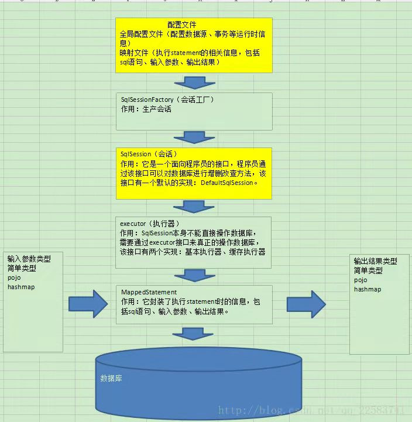
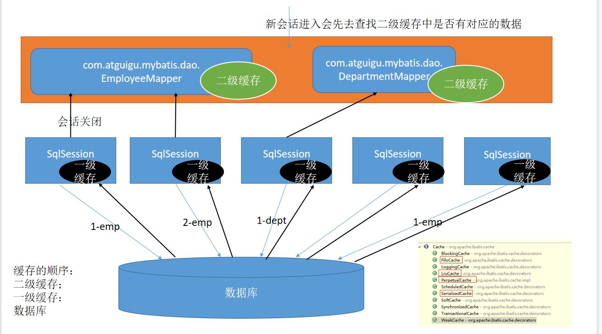
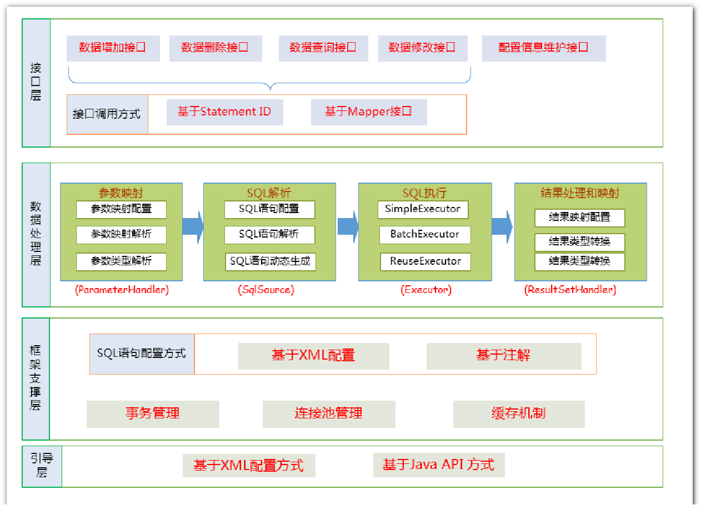
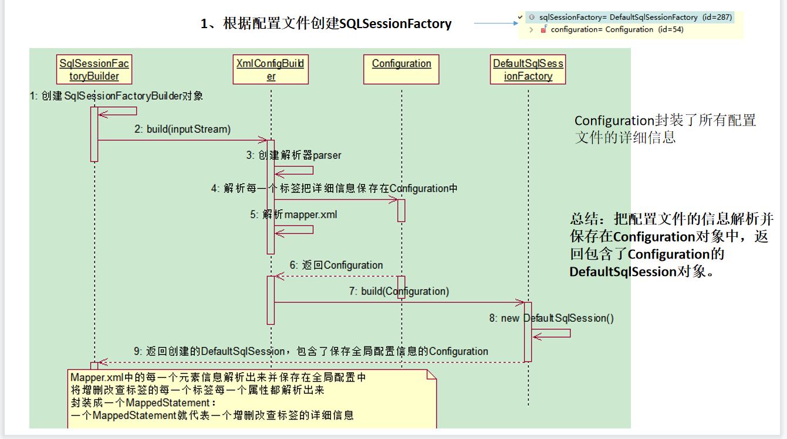
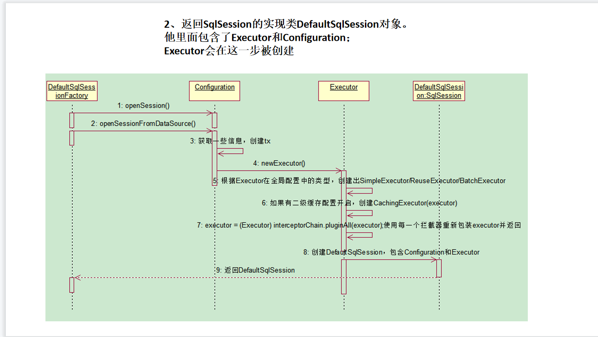

[TOC]


# Mybatis

## 	Mybatis基础

### 		什么是mybatis

> ​		1.mybatis就是一个封装了jdbc操作的持久层框架，是一个半ORM框架。因为mybatis会使用mapper.xml映射文件中的sql语句来操作数据库所以mybatis是一个半ORM框架
>
> ​		2.Mybatis只关注Sql本身的操作，在mapper.xml文件中写sql语句来操作数据库，同时也隐藏了创建链接和创建statement的一些操作，隐藏在mybatis中的配置文件中

> 补充：什么是ORM
>
> ORM （Object Relational Mapping）对象关系映射，作用是在关系型数据库和对象之间作一个映射。使得程序能够通过操作java中的对象就可以来操作数据库




### Mybatis-全局配置文件

**全局配置文件结构：mybatis全局文件中的标签是有顺序的，如果顺序和如下文件结构不同，则会报错**

dtd文件约束

configuration 配置
　　properties 属性:可以加载properties配置文件的信息
　　settings 设置：可以设置mybatis的全局属性
　　typeAliases 类型命名
　　typeHandlers 类型处理器
　　objectFactory 对象工厂
　　plugins 插件
　　environments 环境
　　　　environment 环境变量
　　　　　　transactionManager 事务管理器
　　　　　　dataSource 数据源
　　databaseIdProvider 数据库厂商标识
　　mappers 映射器

```xml

<!-- 配置文件的约束 -->
<?xml version="1.0" encoding="UTF-8" ?>
<!DOCTYPE configuration
  PUBLIC "-//mybatis.org//DTD Config 3.0//EN"
  "http://mybatis.org/dtd/mybatis-3-config.dtd">


<configuration>
    
    
    
    
	<!-- 首行引入配置文件  
　　　　1.mybatis可以使用properties来引入外部properties配置文件的内容
　　　　resource:引入类路径下的资源
　　　　url:引入网络路径或者磁盘路径下的资源
　　　　-->
	<properties resource="db.properties" />
 
    
    
    
    
	<settings>
		<!-- 输出日志配置 -->
		<setting name="logImpl" value="LOG4J" />
		<!--这个配置使全局的映射器启用或禁用二级缓存 -->
		<setting name="cacheEnabled" value="true" />
		<!-- 全局启用或禁用延迟加载。当禁用时，所有的关联对象都会即时加载 -->
		<setting name="lazyLoadingEnabled" value="true" />
		<!--指定mybatis如何映射列到属性 PARTIAL 只会自动映射简单，没有嵌套的结果 FULL 会自动映射任意复杂的结果（嵌套或其他情况) -->
		<setting name="autoMappingBehavior" value="PARTIAL" />
		<!-- 设置超时时间 它决定驱动等待一个数据库的响应的时间 -->
		<setting name="defaultStatementTimeout" value="25" />
		<!--是否开启自动驼峰命名规则映射，即从经典数据库列名A_COLUMN 到经典java属性名aColumn的类似映射 默认false -->
		<setting name="mapUnderscoreToCamelCase" value="false" />
	</settings>
 
    
    
    
    
<!-- typeAliases:别名处理器，可以为我们的java类型起别名,别名不区分大小写 -->
　　<typeAliases>
　　　　<!-- typeAlias:为某个java类型起别名
　　　　type:指定要起别名的类型全类名；默认别名就是类名小写；
　　　　alias:执行新的别名
　　　　 -->
　　　　<typeAlias type="com.neuedu.mybatis.bean.Employee"/>
　　　　<!--
　　　　package:为某个包下的所有类批量起别名
　　　　name:指定包名(为当前包以及下面所有的后代包的每一个类都起一个默认别名【类名小写】)
　　　　-->
　　　　<package name="com.neuedu.mybatis.bean"/>
　　　　<!-- 批量起别名的情况下，使用@Alias注解为某个类型指定新的别名,防止别名重复，mybatis报错 -->
　　</typeAliases>
 
    
    
    
    
    
    
    
    
	<!-- 工作环境 默认是开发模式 -->
	<environments default="test">
		<!-- 配置工作环境为开发者模式 可配置多个  
        　environments:环境们，mybatis可以配置多种环境，default指定使用某种环境。可以达到快速切换环境。

　　　　　　　　environment:配置一个具体的环境信息；必须有两个标签；id代表当前环境的唯一标识

　　　　　　　　　　transactionManager：事务管理器

　　　　　　　　　　　　type:事务管理器的类型;type="[JDBC|MANAGED]"),这两个都是别名，在Configuration类中可以查看具体类！但是Spring对事务的控制才是最终的管理方案!

　　　　　　　　　　　　JDBC:这个配置就是直接使用了JDBC的提交和回滚设置，它依赖于从数据源得到的连接来管理事务。

　　　　　　　　　　　　MANAGED：这个配置几乎没做什么，它从来不提交和回滚一个连接。而是让容器来管理事务的整个生命周期。

　　　　　　　　　　　　所以综上：这里如果要配置事务处理器，就配置为JDBC。表示使用本地的JDBC事务。

　　　　　　　　　　　　当然也可以自定义事务管理器：只需要和人家一样实现TransactionFactory接口，type指定为全类名。

　　　　　　　　　　dataSource:数据源

　　　　　　　　　　　　type:type="[UNPOOLED|POOLED|JNDI]"

　　　　　　　　　　　　unpooled:无数据库连接池

　　　　　　　　　　　　pooled:有数据库连接池

　　　　　　　　　　　　JNDI：自定义数据源：实现DataSourceFactory接口,type也是全类名

　　　　　　　　但是我们也说了，无论是事务管理器的配置还是数据源的配置我们都会使用spring来做，这里只需要了解一下即可！-->
		
        <environment id="development">
			<!-- 采用jdbc的事务管理 -->
			<transactionManager type="JDBC" />
			<!-- 数据源的配置 -->
			<dataSource type="POOLED">
				<property name="driver" value="${mysql.driver}" />
				<property name="url" value="${mysql.url}" />
				<property name="username" value="${mysql.username}" />
				<property name="password" value="${mysql.password}" />
			</dataSource>
		</environment>
        <!--这里配置的是orcal数据源 -->
		<environment id="test">
			<transactionManager type="JDBC" />
			<dataSource type="POOLED">
				<property name="driver" value="${oracle.driver}" />
				<property name="url" value="${oracle.url}" />
				<property name="username" value="${oracle.username}" />
				<property name="password" value="${oracle.password}" />
			</dataSource>
		</environment>
	</environments>
 
    
    
   <!-- 如果想要区分数据源，还需再mapper.xml 中的sql标签中添加databaseId属性  
    eg:


 	 
	<select id="getEmpById" resultType="com.atguigu.mybatis.bean.Employee"
		databaseId="mysql">
		select * from tbl_employee where id = #{id}
	</select>
	<select id="getEmpById" resultType="com.atguigu.mybatis.bean.Employee"
		databaseId="oracle">
		select EMPLOYEE_ID id,LAST_NAME	lastName,EMAIL email 
		from employees where EMPLOYEE_ID=#{id}
	</select>
     -->
	<databaseIdProvider type="DB_VENDOR">
		<property name="MySQL" value="mysql" />
		<property name="Oracle" value="orcl" />
	</databaseIdProvider>
 
    
    
    
    
	<!-- 注册sql映射文件 全局映射文件 映射到包里的路径 使用/ -->
	<mappers>
		<!--注册方式:逐个注册SQL映射文件 -->
		<mapper resource="com/wsm/dao/StudentMapper.xml"/>
		<!--class方式： 1.SQL映射文件名和绑定接口名相同 2.namespace和绑定接口路径相同 3.在接口上全用注解实现，可以不要SQL映射文件 -->
		<!-- <mapper class="com.yc.dao.StudentMapper"/> -->
		<!--注册方式:批量注册：要求和Class方式一样-->
		<!-- <package name="com.yc.dao"/> -->
	</mappers>
</configuration>
```

### mybatis-sql映射文件

```xml-dtd
<?xml version="1.0" encoding="UTF-8" ?>
<!DOCTYPE mapper PUBLIC "-//mybatis.org//DTD Mapper 3.0//EN" "http://mybatis.org/dtd/mybatis-3-mapper.dtd">
<!--mapper为根元素，namespace指定了命名空间:命名空间值为对应接口的全限定类名-->
<mapper namespace="Dao.UserMapper">
    <!--查-->
    <select id="getUserInfo" resultType="User">
        SELECT * FROM UserInfo WHERE UserName=#{uName} 
    </select>

<!-- 增
当向Mysql数据库中插入一条数据的时候，默认是拿不到自增主键的值的， 需要设置如下两个属性才可以拿到主键值！

设置userGeneratedKeys属性值为true:使用自动增长的主键。使用keyProperty设置把主键值设置给哪一个属性

即在mybatis插入数据之后获取数据库自增的主键值，再将这个值封装给javaBean中对应的属性

databaseId是指定当前运行的数据库环境为mysql
-->
    <insert id="addEmp" parameterType="com.neuedu.mybatis.bean.Employee" useGeneratedKeys="true"                                                                         keyProperty="id" databaseId="mysql">
 　　　　insert into tbl_employee(last_name,email,gender) 
 　　　　values(#{lastName},#{gender},#{email})
 　　</insert>

	<delete id="deleteEmpById">
		delete from tbl_employee where id=#{id}
	</delete>


	<update id="updateEmp">
		update tbl_employee 
		set last_name=#{lastName},email=#{email},gender=#{gender}
		where id=#{id}
	</update>
</mapper>
```


### mybatis中的参数处理

#### 1.单个参数

**mybatis不会做特殊处理**

​	#{参数名/任意名}：取出参数值。

#### 2.多个参数

**mybatis会做特殊处理**
	多个参数会被封装成 一个map，
		key：param1...paramN,或者参数的索引也可以
		value：传入的参数值
	#{}就是从map中获取指定的key的值；
	

	异常：
	org.apache.ibatis.binding.BindingException: 
	Parameter 'id' not found. 
	Available parameters are [1, 0, param1, param2]
	操作：
		方法：public Employee getEmpByIdAndLastName(Integer id,String lastName);
		取值：#{id},#{lastName}
		
	这里的正确操作：
		取值 ： #{param1}，#{param2}

**命名参数**

明确指定封装参数时map的key；@Param("id")

​	多个参数会被封装成 一个map，
​		key：使用@Param注解指定的值
​		value：参数值
​	#{指定的key}取出对应的参数值

**POJO**

如果多个参数正好是我们业务逻辑的数据模型，我们就可以直接传入pojo；
	#{属性名}：取出传入的pojo的属性值	

**Map**

如果多个参数不是业务模型中的数据，没有对应的pojo，不经常使用，为了方便，我们也可以传入map
	#{key}：取出map中对应的值

**TO**

如果多个参数不是业务模型中的数据，但是经常要使用，推荐来编写一个TO（Transfer Object）数据传输对象
Page{
	int index;
	int size;
}

**========================思考===============================**

```
public Employee getEmp(@Param("id")Integer id,String lastName);
	取值：id==>#{id/param1}   lastName==>#{param2}
```

```
public Employee getEmp(Integer id,@Param("e")Employee emp);
	取值：id==>#{param1}    lastName===>#{param2.lastName/e.lastName}
```

```
##特别注意：如果是Collection（List、Set）类型或者是数组，
		 也会特殊处理。也是把传入的list或者数组封装在map中。
			key：Collection（collection）,如果是List还可以使用这个key(list)
				数组(data_structure.array)
public Employee getEmpById(List<Integer> ids);
	取值：取出第一个id的值：   #{list[0]}
```


**========================结合源码，mybatis怎么处理参数==========================**
总结：参数多时会封装map，为了不混乱，我们可以使用@Param来指定封装时使用的key；
#{key}就可以取出map中的值；

(@Param("id")Integer id,@Param("lastName")String lastName);
ParamNameResolver解析参数封装map的；
//1、names：{0=id, 1=lastName}；构造器的时候就确定好了

	确定流程：
	1.获取每个标了param注解的参数的@Param的值：id，lastName；  赋值给name;
	2.每次解析一个参数给map中保存信息：（key：参数索引，value：name的值）
		name的值：
			标注了param注解：注解的值
			没有标注：
				1.全局配置：useActualParamName（jdk1.8）：name=参数名
				2.name=map.size()；相当于当前元素的索引
	{0=id, 1=lastName,2=2}


args【1，"Tom",'hello'】:

public Object getNamedParams(Object[] args) {
    final int paramCount = names.size();
    //1、参数为null直接返回
    if (args == null || paramCount == 0) {
      return null;
     
    //2、如果只有一个元素，并且没有Param注解；args[0]：单个参数直接返回
    } else if (!hasParamAnnotation && paramCount == 1) {
      return args[names.firstKey()];
      
    //3、多个元素或者有Param标注
    } else {
      final Map<String, Object> param = new ParamMap<Object>();
      int i = 0;
      
      //4、遍历names集合；{0=id, 1=lastName,2=2}
      for (Map.Entry<Integer, String> entry : names.entrySet()) {
      
      	//names集合的value作为key;  names集合的key又作为取值的参考args[0]:args【1，"Tom"】:
      	//eg:{id=args[0]:1,lastName=args[1]:Tom,2=args[2]}
        param.put(entry.getValue(), args[entry.getKey()]);


​        // add generic param names (param1, param2, ...)param
​        //额外的将每一个参数也保存到map中，使用新的key：param1...paramN
​        //效果：有Param注解可以#{指定的key}，或者#{param1}
​        final String genericParamName = GENERIC_NAME_PREFIX + String.valueOf(i + 1);
​        // ensure not to overwrite parameter named with @Param
​        if (!names.containsValue(genericParamName)) {
​          param.put(genericParamName, args[entry.getKey()]);
​        }
​        i++;
​      }
​      return param;
​    }
  }
}

#### 3.参数的获取

===========================参数值的获取======================================
#{}：可以获取map中的值或者pojo对象属性的值；
${}：可以获取map中的值或者pojo对象属性的值；

select * from tbl_employee where id=${id} and last_name=#{lastName}
Preparing: select * from tbl_employee where id=2 and last_name=?
	区别：
		#{}:是以预编译的形式，将参数设置到sql语句中；PreparedStatement；防止sql注入
		${}:取出的值直接拼装在sql语句中；会有安全问题；
		大多情况下，我们去参数的值都应该去使用#{}；
		

		原生jdbc不支持占位符的地方我们就可以使用${}进行取值
		比如分表、排序。。。；按照年份分表拆分
			select * from ${year}_salary where xxx;
			select * from tbl_employee order by ${f_name} ${order}

#{}:更丰富的用法：
	规定参数的一些规则：
	javaType、 jdbcType、 mode（存储过程）、 numericScale、
	resultMap、 typeHandler、 jdbcTypeName、 expression（未来准备支持的功能）；

	jdbcType通常需要在某种特定的条件下被设置：
		在我们数据为null的时候，有些数据库可能不能识别mybatis对null的默认处理。比如Oracle（报错）；
		
		JdbcType OTHER：无效的类型；因为mybatis对所有的null都映射的是原生Jdbc的OTHER类型，oracle不能正确处理;
		
		由于全局配置中：jdbcTypeForNull=OTHER；oracle不支持；两种办法
		1、#{email,jdbcType=OTHER};
		2、jdbcTypeForNull=NULL
			<setting name="jdbcTypeForNull" value="NULL"/>

### mybatis中的返回值处理

#### resultType

```xml
	//多条记录封装一个map：Map<Integer,Employee>:键是这条记录的主键，值是记录封装后的javaBean
	//@MapKey:告诉mybatis封装这个map的时候使用哪个属性作为map的key
	@MapKey("lastName")
	public Map<String, Employee> getEmpByLastNameLikeReturnMap(String lastName);
	<!--对应的resultType中写需要封装的javaBean的名称-->
 	<select id="getEmpByLastNameLikeReturnMap" resultType="com.atguigu.mybatis.bean.Employee">
 		select * from tbl_employee where last_name like #{lastName}
 	</select>
        
        
        
	//返回一条记录的map；key就是列名，值就是对应的值
	public Map<String, Object> getEmpByIdReturnMap(Integer id);
    <!--此时返回类型为map集合 -->
 	<select id="getEmpByIdReturnMap" resultType="map">
 		select * from tbl_employee where id=#{id}
 	</select>
        
        
        
        
        
	public List<Employee> getEmpsByLastNameLike(String lastName);
	<!--resultType：如果返回的是一个集合，要写集合中元素的类型  -->
	<select id="getEmpsByLastNameLike" resultType="com.atguigu.mybatis.bean.Employee">
		select * from tbl_employee where last_name like #{lastName}
	</select>
        
        
        
 
 	
 
 
    public List<Employee> getEmpsByLastNameLike(String lastName); 
	<!--resultType：如果返回的是一个集合，要写集合中元素的类型  -->
	<select id="getEmpsByLastNameLike" resultType="com.atguigu.mybatis.bean.Employee">
		select * from tbl_employee where last_name like #{lastName}
	</select>
        
        
    public Employee getEmpByMap(Map<String, Object> map);
 	<!-- resultType：如果返回的为单个的javaBean，则要写该类的全限定名称 -->
 	<select id="getEmpByMap" resultType="com.atguigu.mybatis.bean.Employee">
 		select * from ${tableName} where id=${id} and last_name=#{lastName}
 	</select>
 
```


#### resultMap

```xml
<mapper namespace="com.atguigu.mybatis.dao.EmployeeMapperPlus">

    
    <!-- 一般定义封装规则
	自定义某个javaBean的封装规则
	type：自定义规则的Java类型
	id:唯一id方便引用
	   -->
<resultMap type="com.atguigu.mybatis.bean.Employee" id="MySimpleEmp">
<!-- 指定主键列的封装规则
		id定义主键会底层有优化；
		column：指定哪一列
		property：指定对应的javaBean属性
		   -->
<id column="id" property="id"/>
<!--  定义普通列封装规则  -->
<result column="last_name" property="lastName"/>
<!--  其他不指定的列会自动封装：我们只要写resultMap就把全部的映射规则都写上。  -->
<result column="email" property="email"/>
<result column="gender" property="gender"/>
</resultMap>
<!--  resultMap:自定义结果集映射规则；   -->
<!--  public Employee getEmpById(Integer id);  -->
<select id="getEmpById" resultMap="MySimpleEmp"> select * from tbl_employee where id=#{id} </select>
    
    
    
<!--  封装的javaBean属性中含有其他的javaBean，使用联合查询并级联属性封装结果集
	场景一：
		查询Employee的同时查询员工对应的部门
		Employee===Department
		一个员工有与之对应的部门信息；
		id  last_name  gender    d_id     did  dept_name (private Department dept;)
	  -->
    
<!-- 联合查询：级联属性封装结果集  -->
<resultMap type="com.atguigu.mybatis.bean.Employee" id="MyDifEmp">
<id column="id" property="id"/>
<result column="last_name" property="lastName"/>
<result column="gender" property="gender"/>
<result column="did" property="dept.id"/>
<result column="dept_name" property="dept.departmentName"/>
</resultMap>
    
    
    
<!-- 使用association定义关联的单个对象的封装规则； -->
<resultMap type="com.atguigu.mybatis.bean.Employee" id="MyDifEmp2">
<id column="id" property="id"/>
<result column="last_name" property="lastName"/>
<result column="gender" property="gender"/>
<!--   association可以指定联合的javaBean对象
		property="dept"：指定哪个属性是联合的对象
		javaType:指定这个属性对象的类型[不能省略]
		 -->
<association property="dept" javaType="com.atguigu.mybatis.bean.Department">
<id column="did" property="id"/>
<result column="dept_name" property="departmentName"/>
</association>
</resultMap>
<!--   public Employee getEmpAndDept(Integer id); -->
<select id="getEmpAndDept" resultMap="MyDifEmp"> SELECT e.id id,e.last_name last_name,e.gender gender,e.d_id d_id, d.id did,d.dept_name dept_name FROM tbl_employee e,tbl_dept d WHERE e.d_id=d.id AND e.id=#{id} </select>
    
    
    
<!--  使用association进行分步查询：
		1、先按照员工id查询员工信息
		2、根据查询员工信息中的d_id值去部门表查出部门信息
		3、部门设置到员工中；
	  -->
<!--   id  last_name  email   gender    d_id  需要定义封装规则的列  -->
<resultMap type="com.atguigu.mybatis.bean.Employee" id="MyEmpByStep">
<id column="id" property="id"/>
<result column="last_name" property="lastName"/>
<result column="email" property="email"/>
<result column="gender" property="gender"/>
<!--  association定义关联对象的封装规则
	 		select:表明当前属性是调用select指定的方法查出的结果，指定的方法是已经定义过的接口中的方法
	 		column:指定将哪一列的值传给这个方法
	 		
	 		流程：使用select指定的方法（传入column指定的这列参数的值）查出对象，并封装给property指定的属性
	 	  -->
<association property="dept" select="com.atguigu.mybatis.dao.DepartmentMapper.getDeptById" column="d_id"> </association>
</resultMap>
<!--   public Employee getEmpByIdStep(Integer id); -->
<select id="getEmpByIdStep" resultMap="MyEmpByStep">
select * from tbl_employee where id=#{id}
<if test="_parameter!=null"> and 1=1 </if>
</select>
    
    
    
<!--  可以使用延迟加载（懒加载）；(按需加载)
	 	Employee==>Dept：
	 		我们每次查询Employee对象的时候，都将一起查询出来。
	 		部门信息在我们使用的时候再去查询；
	 		分段查询的基础之上加上两个配置：
	   -->
<!--  ==================association============================  -->
<!--  一对多查询定义封装规则
	场景二：
		查询部门的时候将部门对应的所有员工信息也查询出来：注释在DepartmentMapper.xml中
	  -->
    
    
    
 
<!--  
	public class Department {
			private Integer id;
			private String departmentName;
			private List<Employee> emps;
	  did  dept_name  ||  eid  last_name  email   gender  
	  -->
<!-- 嵌套结果集的方式，使用collection标签定义关联的集合类型的属性封装规则   -->
<resultMap type="com.atguigu.mybatis.bean.Department" id="MyDept">
<id column="did" property="id"/>
<result column="dept_name" property="departmentName"/>
<!--  
			collection定义关联集合类型的属性的封装规则 
			ofType:指定集合里面元素的类型
		 -->
<collection property="emps" ofType="com.atguigu.mybatis.bean.Employee">
<!--  定义这个集合中元素的封装规则  -->
<id column="eid" property="id"/>
<result column="last_name" property="lastName"/>
<result column="email" property="email"/>
<result column="gender" property="gender"/>
</collection>
</resultMap>
<!--  public Department getDeptByIdPlus(Integer id);  -->
<select id="getDeptByIdPlus" resultMap="MyDept"> SELECT d.id did,d.dept_name dept_name, e.id eid,e.last_name last_name,e.email email,e.gender gender FROM tbl_dept d LEFT JOIN tbl_employee e ON d.id=e.d_id WHERE d.id=#{id} </select>
    
    
<!--  collection：分段查询  -->
<resultMap type="com.atguigu.mybatis.bean.Department" id="MyDeptStep">
<id column="id" property="id"/>
<id column="dept_name" property="departmentName"/>
<collection property="emps" select="com.atguigu.mybatis.dao.EmployeeMapperPlus.getEmpsByDeptId" column="{deptId=id}" fetchType="lazy"/>
</resultMap>
<!--  public Department getDeptByIdStep(Integer id);  -->
<select id="getDeptByIdStep" resultMap="MyDeptStep"> select id,dept_name from tbl_dept where id=#{id} </select>
<!--  扩展：多列的值传递过去：
			将多列的值封装map传递；
			column="{key1=column1,key2=column2}"
		fetchType="lazy"：表示使用延迟加载；
				- lazy：延迟
				- eager：立即
	  -->
    
<!--  public List<Employee> getEmpsByDeptId(Integer deptId);  -->
<select id="getEmpsByDeptId" resultType="com.atguigu.mybatis.bean.Employee"> select * from tbl_employee where d_id=#{deptId} </select>
    
    
    
    
<!--  =======================鉴别器============================  -->
<!--  <discriminator javaType=""></discriminator>
		鉴别器：mybatis可以使用discriminator判断某列的值，然后根据某列的值改变封装行为
		封装Employee：
			如果查出的是女生：就把部门信息查询出来，否则不查询；
			如果是男生，把last_name这一列的值赋值给email;
	  -->
<resultMap type="com.atguigu.mybatis.bean.Employee" id="MyEmpDis">
<id column="id" property="id"/>
<result column="last_name" property="lastName"/>
<result column="email" property="email"/>
<result column="gender" property="gender"/>
<!-- 
	 		column：指定判定的列名
	 		javaType：列值对应的java类型   -->
<discriminator javaType="string" column="gender">
<!-- 女生  resultType:指定封装的结果类型；不能缺少。/resultMap -->
<case value="0" resultType="com.atguigu.mybatis.bean.Employee">
<association property="dept" select="com.atguigu.mybatis.dao.DepartmentMapper.getDeptById" column="d_id"> </association>
</case>
<!-- 男生 ;如果是男生，把last_name这一列的值赋值给email;  -->
<case value="1" resultType="com.atguigu.mybatis.bean.Employee">
<id column="id" property="id"/>
<result column="last_name" property="lastName"/>
<result column="last_name" property="email"/>
<result column="gender" property="gender"/>
</case>
</discriminator>
</resultMap>
</mapper>
```


#### 插入时返回主键值


```xml
	
	<!-- public void addEmp(Employee employee); -->
	<!-- parameterType：参数类型，可以省略， 
	获取自增主键的值：
		mysql支持自增主键，自增主键值的获取，mybatis也是利用statement.getGenreatedKeys()；
		useGeneratedKeys="true"；使用自增主键获取主键值策略
		keyProperty；指定对应的主键属性，也就是mybatis获取到主键值以后，将这个值封装给javaBean的哪个属性
	-->
	<insert id="addEmp" parameterType="com.atguigu.mybatis.bean.Employee"
		useGeneratedKeys="true" keyProperty="id" databaseId="mysql">
		insert into tbl_employee(last_name,email,gender) 
		values(#{lastName},#{email},#{gender})
	</insert>
	
	<!-- 
	获取非自增主键的值：
		Oracle不支持自增；Oracle使用序列来模拟自增；
		每次插入的数据的主键是从序列中拿到的值；如何获取到这个值；
	 -->
	<insert id="addEmp" databaseId="oracle">
		<!-- 
		keyProperty:查出的主键值封装给javaBean的哪个属性
		order="BEFORE":当前sql在插入sql之前运行
			   AFTER：当前sql在插入sql之后运行
		resultType:查出的数据的返回值类型
		
		BEFORE运行顺序：
			先运行selectKey查询id的sql；查出id值封装给javaBean的id属性
			在运行插入的sql；就可以取出id属性对应的值
		AFTER运行顺序：
			先运行插入的sql（从序列中取出新值作为id）；
			再运行selectKey查询id的sql；
		 -->
		<selectKey keyProperty="id" order="BEFORE" resultType="Integer">
			<!-- 编写查询主键的sql语句 -->
			<!-- BEFORE-->
			select EMPLOYEES_SEQ.nextval from dual 
			<!-- AFTER：
			 select EMPLOYEES_SEQ.currval from dual -->
		</selectKey>
		
		<!-- 插入时的主键是从序列中拿到的 -->
		<!-- BEFORE:-->
		insert into employees(EMPLOYEE_ID,LAST_NAME,EMAIL) 
		values(#{id},#{lastName},#{email<!-- ,jdbcType=NULL -->}) 
		<!-- AFTER：
		insert into employees(EMPLOYEE_ID,LAST_NAME,EMAIL) 
		values(employees_seq.nextval,#{lastName},#{email}) -->
	</insert>
	
 
```


​	

### mybatis中的动态SQL

+  choose (when, otherwise):分支选择；带了break的swtich-case，如果带了id就用id查，如果带了lastName就用lastName查;只会进入其中一个
+  trim 字符串截取(where(封装查询条件), set(封装修改条件))
+ foreach 遍历集合


#### if: test 判断

```xml
<!--  查询员工，要求，携带了哪个字段查询条件就带上这个字段的值  -->
<!--  public List<Employee> getEmpsByConditionIf(Employee employee);  -->
<select id="getEmpsByConditionIf" resultType="com.atguigu.mybatis.bean.Employee">
select * from tbl_employee
<!--  where  -->
<where>
<!--  test：判断表达式（OGNL）
		 	OGNL参照PPT或者官方文档。
		 	  	 c:if  test
		 	从参数中取值进行判断
		 	
		 	遇见特殊符号应该去写转义字符：
		 	&&：
		 	 -->
<if test="id!=null"> id=#{id} </if>
<if test="lastName!=null && lastName!="""> and last_name like #{lastName} </if>
<if test="email!=null and email.trim()!="""> and email=#{email} </if>
<!--  ognl会进行字符串与数字的转换判断  "0"==0  -->
<if test="gender==0 or gender==1"> and gender=#{gender} </if>
</where>
</select>
```

#### trim

```xml
<!-- public List<Employee> getEmpsByConditionTrim(Employee employee);   -->
<select id="getEmpsByConditionTrim" resultType="com.atguigu.mybatis.bean.Employee">
select * from tbl_employee
<!--  后面多出的and或者or where标签不能解决 
	 	prefix="":前缀：trim标签体中是整个字符串拼串 后的结果。
	 			prefix给拼串后的整个字符串加一个前缀 
	 	prefixOverrides="":
	 			前缀覆盖： 去掉整个字符串前面多余的字符
	 	suffix="":后缀
	 			suffix给拼串后的整个字符串加一个后缀 
	 	suffixOverrides=""
	 			后缀覆盖：去掉整个字符串后面多余的字符 			
	 	 -->
<!--  自定义字符串的截取规则  -->
<trim prefix="where" suffixOverrides="and | or">
<if test="id!=null"> id=#{id} and </if>
<if test="lastName!=null && lastName!="""> last_name like #{lastName} and </if>
<if test="email!=null and email.trim()!="""> email=#{email} and </if>
<!--  ognl会进行字符串与数字的转换判断  "0"==0  -->
<if test="gender==0 or gender==1"> gender=#{gender} </if>
</trim>
</select>

```

#### choose：when：test 选择

```xml
<!--choose  when  -->
<!--  public List<Employee> getEmpsByConditionChoose(Employee employee);  -->
<select id="getEmpsByConditionChoose" resultType="com.atguigu.mybatis.bean.Employee">
select * from tbl_employee
<where>
<!--  如果带了id就用id查，如果带了lastName就用lastName查;只会进入其中一个  -->
<choose>
<when test="id!=null"> id=#{id} </when>
<when test="lastName!=null"> last_name like #{lastName} </when>
<when test="email!=null"> email = #{email} </when>
<otherwise> gender = 0 </otherwise>
</choose>
</where>
</select>
```

#### foreach 循环

```xml
<!--  foreach: 主要是根据配置的属性进行字符串的拼接，组成一条完整的sql之后执行  -->
<!-- public List<Employee> getEmpsByConditionForeach(List<Integer> ids);   -->
<select id="getEmpsByConditionForeach" resultType="com.atguigu.mybatis.bean.Employee">
select * from tbl_employee
<!-- 
	 		collection：指定要遍历的集合：
	 			list类型的参数会特殊处理封装在map中，map的key就叫list
	 		item：将当前遍历出的元素赋值给指定的变量
	 		separator:每个元素之间的分隔符
	 		open：遍历出所有结果拼接一个开始的字符
	 		close:遍历出所有结果拼接一个结束的字符
	 		index:索引。遍历list的时候是index就是索引，item就是当前值
	 				      遍历map的时候index表示的就是map的key，item就是map的值
	 		
	 		#{变量名}就能取出变量的值也就是当前遍历出的元素
	 	   -->
<foreach collection="ids" item="item_id" separator="," open="where id in(" close=")"> #{item_id} </foreach>
</select>


<!--  批量保存  -->
<!-- public void addEmps(@Param("emps")List<Employee> emps);   -->


<!-- MySQL下批量保存：可以foreach遍历   mysql支持values(),(),()语法 -->
<!--第一种，sql的拼接-->
<insert id="addEmps">
insert into tbl_employee(
<include refid="insertColumn"/>
) values
<foreach collection="emps" item="emp" separator=","> (#{emp.lastName},#{emp.email},#{emp.gender},#{emp.dept.id}) </foreach>
</insert>
<!--  第二种，执行多条sql   -->
<!--  这种方式需要数据库连接属性allowMultiQueries=true；
	 	这种分号分隔多个sql可以用于其他的批量操作（删除，修改）  -->
<!--  <insert id="addEmps">
	 	<foreach collection="emps" item="emp" separator=";">
	 		insert into tbl_employee(last_name,email,gender,d_id)
	 		values(#{emp.lastName},#{emp.email},#{emp.gender},#{emp.dept.id})
	 	</foreach>
	 </insert>  -->


<!--  Oracle数据库批量保存： 
	 	Oracle不支持values(),(),()
	 	Oracle支持的批量方式
	 	1、多个insert放在begin - end里面
	 		begin
			    insert into employees(employee_id,last_name,email) 
			    values(employees_seq.nextval,'test_001','test_001@atguigu.com');
			    insert into employees(employee_id,last_name,email) 
			    values(employees_seq.nextval,'test_002','test_002@atguigu.com');
			end;
		2、利用中间表：
			insert into employees(employee_id,last_name,email)
		       select employees_seq.nextval,lastName,email from(
		              select 'test_a_01' lastName,'test_a_e01' email from dual
		              union
		              select 'test_a_02' lastName,'test_a_e02' email from dual
		              union
		              select 'test_a_03' lastName,'test_a_e03' email from dual
		       )	
	  -->
<insert id="addEmps" databaseId="oracle">
<!--  oracle第一种批量方式  -->
<!--  <foreach collection="emps" item="emp" open="begin" close="end;">
	 		insert into employees(employee_id,last_name,email) 
			    values(employees_seq.nextval,#{emp.lastName},#{emp.email});
	 	</foreach>  -->
<!--  oracle第二种批量方式   -->
insert into employees(
<!--  引用外部定义的sql  -->
<include refid="insertColumn">
<property name="testColomn" value="abc"/>
</include>  
     
)
<foreach collection="emps" item="emp" separator="union" open="select employees_seq.nextval,lastName,email from(" close=")"> select #{emp.lastName} lastName,#{emp.email} email from dual </foreach>
</insert>
```


#### 内置参数与数据绑定


```xml

内置参数
<!--  两个内置参数：
	 	不只是方法传递过来的参数可以被用来判断，取值。。。
	 	mybatis默认还有两个内置参数：
	 	_parameter:代表整个参数
	 		单个参数：_parameter就是这个参数
	 		多个参数：参数会被封装为一个map；_parameter就是代表这个map
	 	
	 	_databaseId:如果配置了databaseIdProvider标签。
	 		_databaseId就是代表当前数据库的别名oracle
	   -->
<!-- public List<Employee> getEmpsTestInnerParameter(Employee employee);   -->
<select id="getEmpsTestInnerParameter" resultType="com.atguigu.mybatis.bean.Employee">
    
数据绑定 
<!--  bind：可以将OGNL表达式的值绑定到一个变量中，方便后来引用这个变量的值  -->
<bind name="_lastName" value="'%'+lastName+'%'"/>
<if test="_databaseId=='mysql'">
select * from tbl_employee
<if test="_parameter!=null"> where last_name like #{lastName} </if>
</if>
<if test="_databaseId=='oracle'">
select * from employees
<if test="_parameter!=null"> where last_name like #{_parameter.lastName} </if>
</if>
</select>

```

#### sql的抽取

```xml

 
<!--  
	  	抽取可重用的sql片段。方便后面引用 
	  	1、sql抽取：经常将要查询的列名，或者插入用的列名抽取出来方便引用
	  	2、include来引用已经抽取的sql：
	  	3、include还可以自定义一些property，sql标签内部就能使用自定义的属性
	  			include-property：取值的正确方式${prop},
	  			#{不能使用这种方式}
	   -->
<sql id="insertColumn">
<if test="_databaseId=='oracle'"> employee_id,last_name,email </if>
<if test="_databaseId=='mysql'"> last_name,email,gender,d_id </if>
</sql>
```

#### set 与 where 标签

```xml
set 标签元素主要是用在更新操作的时候，它的主要功能和 where 标签元素其实是差不多的，主要是在包含的语句前输出一个 set，然后如果包含的语句是以逗号结束的话将会把该逗号忽略，如果 set 包含的内容为空的话则会出错。有了 set 元素就可以动态的更新那些修改了的字段。

<!-- public void updateEmp(Employee employee);   -->
<update id="updateEmp">
<!--  Set标签的使用  -->
update tbl_employee
<set>
<if test="lastName!=null"> last_name=#{lastName}, </if>
<if test="email!=null"> email=#{email}, </if>
<if test="gender!=null"> gender=#{gender} </if>
</set>
where id=#{id}
<!--  		
		Trim：更新拼串
		update tbl_employee 
		<trim prefix="set" suffixOverrides=",">
			<if test="lastName!=null">
				last_name=#{lastName},
			</if>
			<if test="email!=null">
				email=#{email},
			</if>
			<if test="gender!=null">
				gender=#{gender}
			</if>
		</trim>
		where id=#{id}   -->
</update> 


where 元素知道只有在一个及以上的if条件有值的情况下才去插入“WHERE”子句。而且，若最后的内容是“AND”或“OR”开头的，where 元素也知道如何将他们去除。


<select id="findActiveBlogLike"
     resultType="Blog">
  SELECT * FROM BLOG 
  <where> 
    <if test="state != null">
         state = #{state}
    </if> 
    <if test="title != null">
        AND title like #{title}
    </if>
    <if test="author != null and author.name != null">
        AND author_name like #{author.name}
    </if>
  </where>
</select>
</mapper>
```

### mybatis中的缓存机制

**注意：在mybatis中是先查询二级缓存，再查询一级缓存，一级缓存中的数据只有在SQL session关闭或者提交之后才会将自身的数据上传到二级缓存中**

#### Mybatis 的一级缓存原理（sqlsession级别）

+ 第一次发出一个查询 sql，sql 查询结果写入 sqlsession 的一级缓存中，缓存使用的数据结构是一个 map。

+ key：MapperID+offset+limit+Sql+所有的入参 

+ value：用户信息 

同一个 sqlsession 再次发出相同的 sql，就从缓存中取出数据。如果两次中间出现 commit 操作（修改、添加、删除），本 sqlsession 中的 一级缓存区域全部清空，下次再去缓存中查询不到所以要从数据库查询，从数据库查询到再写入缓存。

####  二级缓存原理（mapper中的namespace）

+ key：MapperID+offset+limit+Sql+所有的入参 

+ value：用户信息

>  二级缓存的范围是mapper 级别（mapper同一个命名空间），mapper以命名空间为单位创建缓存数据结构，结构是 map。mybatis 的二 级缓存是通过 CacheExecutor 实现的。CacheExecutor 其实是 Executor 的代理对象。所有的查询操作，在 CacheExecutor 中都会先匹配 缓存中是否存在，不存在则查询数据库。

**具体使用需要配置** 

1. Mybatis 全局配置中启用二级缓存配置 
2. 在对应的 Mapper.xml 中配置 cache 节点 
3. 在对应的 select 查询节点中添加 useCache=true

```xml
<mapper namespace="com.atguigu.mybatis.dao.EmployeeMapper">
<cache type="org.mybatis.caches.ehcache.EhcacheCache"/>
<!--  <cache eviction="FIFO" flushInterval="60000" readOnly="false" size="1024"></cache>  -->
<!--   
	eviction:缓存的回收策略：
		• LRU – 最近最少使用的：移除最长时间不被使用的对象。
		• FIFO – 先进先出：按对象进入缓存的顺序来移除它们。
		• SOFT – 软引用：移除基于垃圾回收器状态和软引用规则的对象。
		• WEAK – 弱引用：更积极地移除基于垃圾收集器状态和弱引用规则的对象。
		• 默认的是 LRU。
	flushInterval：缓存刷新间隔
		缓存多长时间清空一次，默认不清空，设置一个毫秒值
	readOnly:是否只读：
		true：只读；mybatis认为所有从缓存中获取数据的操作都是只读操作，不会修改数据。
				 mybatis为了加快获取速度，直接就会将数据在缓存中的引用交给用户。不安全，速度快
		false：非只读：mybatis觉得获取的数据可能会被修改。
				mybatis会利用序列化&反序列的技术克隆一份新的数据给你。安全，速度慢
	size：缓存存放多少元素；
	type=""：指定自定义缓存的全类名；
			实现Cache接口即可；
	 -->

</mapper>
```




## mybatis中的运行原理与机制




#### 1.创建SqlSessionFactory

> 1. mybatis-config.xml 就是mybatis的全局配置文件
> 2. mybatis通过读取mybatis-config.xml文件会获取其中所有的标签，通过解析器解析xml文件类似与解析DOM元素并将标签中的数据封装成一个Configuration对象，该对象中含有所有mybatis配置文件中的数据，
> 3. Configuration对象不仅含有配置数据，也含有mapper数据，mybatis通过mappers标签中注册的所有mapper的地址获取文件，并解析xml文件，其中，Configuration对象中含有一个Map集合（knownMappers）用于维护各个mapper对象中的数据
> 4. Mapper.xml中的每一个元素信息解析出来并保存在全局配置中，将增删改查标签的每一个标签，每一个属性都解析并封装成一个MappedStatement对象，一个MppedStatement对象就代表某个增删改查标签的全部信息
> 5. MappedStatement保存在MappedStatements中存储在Mapper对象中
> 6. 最后通过Configuration对象创建DefaultSqlSessionFactory对象并返回

**总结：Configuration对象封装了所有配置文件的详细信息，通过该对象创建DefaultSqlSession对象并返回**


```java
String resource = "mybatis-config.xml";
InputStream inputStream = Resourses.getResourceAsStream(resource);
SqlSessionFactory factory = new SqlSessionFactoryBuilder().build(inputStream);
```




#### 2.获取SqlSession对象

```java
SqlSession session = factory.openSession();
```




#### 3.使用SqlSession获取映射器

```java
SqlSession sqlSession = factory.openSession();
try{
	EmployeeMapper mapper = sqlSession.getMapper(EmployeeMapper.class);
}finally{
    sqlSession.close();
}
```

#### 4.使用映射器调用mapper中的方法

```
Employee employee = mapper.getEmpById(1);

```

#### mybatis原理总结

>```java
>/**
> * 1、获取sqlSessionFactory对象:
> *        解析文件的每一个信息保存在Configuration中，返回包含Configuration的DefaultSqlSession；
> *        注意：【MappedStatement】：代表一个增删改查的详细信息
> * 
> * 2、获取sqlSession对象
> *        返回一个DefaultSQlSession对象，包含Executor和Configuration;
> *        这一步会创建Executor对象；
> * 
> * 3、获取接口的代理对象（MapperProxy）
> *        getMapper，使用MapperProxyFactory创建一个MapperProxy的代理对象
> *        代理对象里面包含了，DefaultSqlSession（Executor）
> * 4、执行增删改查方法
> * 
> * 总结：
> *     1、根据配置文件（全局，sql映射）初始化出Configuration对象
> *     2、创建一个DefaultSqlSession对象，
> *        他里面包含Configuration以及
> *        Executor（根据全局配置文件中的defaultExecutorType创建出对应的Executor）
> *  3、DefaultSqlSession.getMapper（）：拿到Mapper接口对应的MapperProxy；
> *  4、MapperProxy里面有（DefaultSqlSession）；
> *  5、执行增删改查方法：
> *        1）、调用DefaultSqlSession的增删改查（Executor）；
> *        2）、会创建一个StatementHandler对象。
> *           （同时也会创建出ParameterHandler和ResultSetHandler）
> *        3）、调用StatementHandler预编译参数以及设置参数值;
> *           使用ParameterHandler来给sql设置参数
> *        4）、调用StatementHandler的增删改查方法；
> *        5）、ResultSetHandler封装结果
> *  注意：
> *     四大对象每个创建的时候都有一个interceptorChain.pluginAll(parameterHandler);
>```
>
>


### 插件


## mybatis面试

### 1. 什么是mybatis

> mybatis是一款持久层框架，属于半ORM（对象关系映射）框架，mybatis支持定制sql，存储过程，高级映射，

### 2.ORM是什么

>ORM（object relational Mapping）对象关系映射，

