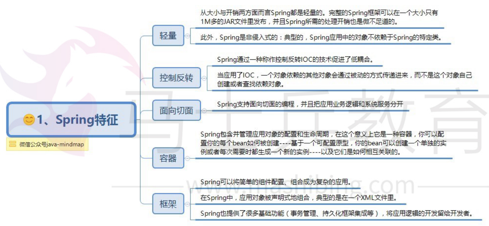
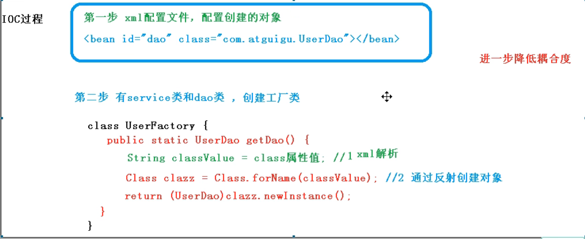
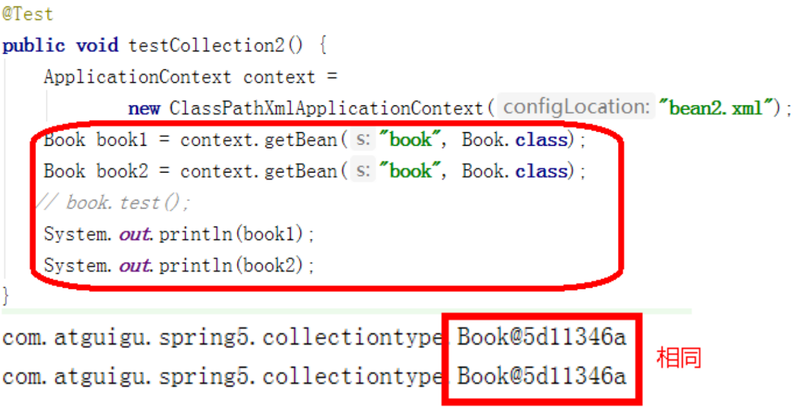
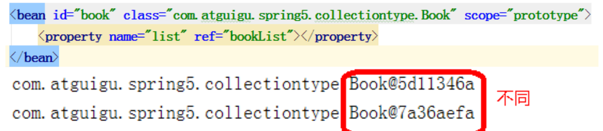
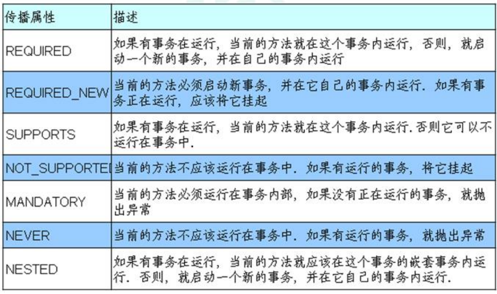
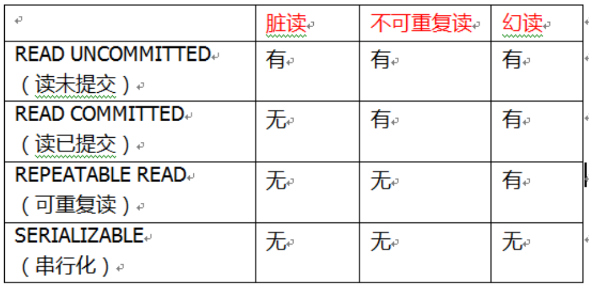

[TOC]


# Spring5

> spring  是一个全面的企业应用开发一站式的解决方案

**特点**

1. 轻量级
2. 控制反转
3. AOP面向切面
4. IOC容器
5. 框架集合




## spring配置文件-bean.xml

**bean.xml**

```xml
```


### bean.xml测试

```java
@Test
public void testUser(){
    // 1. 加载spring配置文件
    ApplicationContext context = new ClassPathXmlApplicationContext("bean.xml");
    // 2. 获取配置并创建对象
    User user = Context.getBean("user",User.class);
    System.out.println(user);
    user.add();
}
```

## IOC

### bean创建过程

**IOC通过xml配置文件创建对象的过程**

1. 先通过bean.xml获取配置信息，之后通过工厂模式和反射机制创建对象



### IOC容器接口

> 1. IOC思想是基于IOC容器完成的，IOC容器底层就是对象工厂
> 2. Spring提供IOC容器两种实现方式（即两个接口）
>    1. BeanFactory：IOC容器的基本实现，是Spring框架内部使用的接口，不向外提供使用，**该方式属于懒加载模式，加载配置文件时不会创建对象，只有在获取对象时才会去创建对象**
>    2. ApplicationContext：该接口是BeanFactory接口的子接口，有更多更强大的功能，提供给开发人员使用，**使用该接口在加载配置文件时会创建配置文件中所有的对象，用于web开发阶段（提前将对象创建，节省时间，更好的用户体验）**

### IOC操作Bean（基于XML）

####  创建Bean

+ 普通创建对象方式

```java
Bean bean = new Bean();
```

+ 基于XML方式创建对象

  ```xml
  // 配置User对象
  <bean id="user" class="com.spring.pojo.User"></bean>
  <!-- 
  1. id:该对象的唯一标识，之后我们需要通过id值来获取创建的对象
  2. class: 该类的全路径，spring在底层中是通过传入的全路径和工厂模式加反射机制来创建对象的
  -->
  
  ```
  
  **创建对象时默认执行的是无参构造new出的对象**

```java
// 通过xml文件方式创建对象如何获取
	// 1.读取xml文件获取ApplicationContext对象
 	ApplicationContext context =   new ClassPathXmlApplicationContext("bean.xml");
    // 2. 获取配置并创建对象
    User user = Context.getBean("user",User.class);
```


#### 依赖注入

**这里的依赖注入就是创建对象时给对象的属性注入属性值**

##### 1.set注入

1. 创建类，定义属性和对应的 set 方法 

 ```java
 /**
 * 演示使用 set 方法进行注入属性
 */
 public class Book {
      //创建属性
      private String bname;
      private String bauthor;
      //创建属性对应的 set 方法 ，通过set进行依赖注入，必须要写set方法
      public void setBname(String bname) {
          this.bname = bname;
      }
      public void setBauthor(String bauthor) {
         this.bauthor = bauthor;
      }
 }
 ```


2. 在 spring 配置文件配置对象创建，配置属性注入    **(property)**

```xml
<!--2 set 方法注入属性-->
<bean id="book" class="com.atguigu.spring5.Book">
     <!--使用 property 完成属性注入
     name：类里面属性名称
     value：向属性注入的值
     -->
     <property name="bname" value="易筋经"></property>
     <property name="bauthor" value="达摩老祖"></property>
</bean>

```

##### 2.有参构造注入

1. 创建Orders类时通过有参构造注入属性值时需要添加有参构造函数

```java
public class Orders {
 	//属性
     private String oname;
     private String address;
     //有参数构造，通过有参构造注入时，必须要有有参构造函数
     public Orders(String oname,String address) {
        this.oname = oname;
        this.address = address;
     }
}
```

2. 在Spring的bean.xml文件中进行配置**（constructor-arg）**

```xml
<bean id="orders" class="com.atguigu.spring5.Orders">
     <constructor-arg name="oname" value="电脑"></constructor-arg>
     <constructor-arg name="address" value="China"></constructor-arg>
</bean>

```

#### 其他类型的依赖注入

##### 1. 字面量

1. 给属性注入**null**值

```xml
<!-- 这里是通过property进行set方法注入null值-->
<property name="address">
	 <null/>
</property>
```

2. 给属性注入特殊字符

```xml
（2）属性值包含特殊符号
    <!--属性值包含特殊符号
     1 把<>进行转义 &lt; &gt;
     2 把带特殊符号内容写到 CDATA
    -->
<property name="address">
 	<value><![CDATA[<<南京>>]]></value>
</property>
```

##### 2.注入外部bean

> 当service类中的属性有dao类，并调用dao类中的方法
>
> 1. 通过bean标签创建dao对象实例
> 2. 在创建service对象实例时，通过set方法和ref属性，将创建好的dao对象实例注入到service对象实例的属性中

```xml
<!--1 service 和 dao 对象创建-->
<bean id="userDaoImpl" class="com.atguigu.spring5.dao.UserDaoImpl"></bean>

 
<bean id="userService" class="com.atguigu.spring5.service.UserService">
     <!--注入 userDao 对象
     name 属性：类里面属性名称
     ref 属性：创建 userDao 对象 bean 标签 id 值
     -->
     <property name="userDao" ref="userDaoImpl"></property>
    </bean>

```

##### 3.注入内部bean

```xml
<!--内部 bean-->
<bean id="emp" class="com.atguigu.spring5.bean.Emp">
     <!--设置两个普通属性-->
     <property name="ename" value="lucy"></property>
     <property name="gender" value="女"></property>
     <!--设置对象类型属性 直接在属性property标签中创建属性类型的bean-->
     <property name="dept">
         <bean id="dept" class="com.atguigu.spring5.bean.Dept">
         	<property name="dname" value="安保部"></property>
         </bean>
     </property>
</bean>
```

##### 4.注入集合属性

**基本数据类型和String类型**

````xml
<!--1 集合类型属性注入-->
<bean id="stu" class="com.atguigu.spring5.collectiontype.Stu">
	 <!--数组类型属性注入-->
 	<property name="courses">
 		<data_structure.array>
 			<value>java 课程</value>
 			<value>数据库课程</value>
 		</data_structure.array>
 	</property>
    
 <!--2. list 类型属性注入-->
 	<property name="list">
 		<list>
 			<value>张三</value>
 			<value>小三</value>
 		</list>
 	</property>
    
 <!--3. map 类型属性注入-->
 	<property name="maps">
 		<map>
 			<entry key="JAVA" value="java"></entry>
 			<entry key="PHP" value="php"></entry>
 		</map>
 	</property>
 <!--4. set 类型属性注入-->
 	<property name="sets">
 		<set>
 			<value>MySQL</value>
 			<value>Redis</value>
 		</set>
 	</property>
</bean>
````

**对象类型依赖注入**

> 先创建多个对象实例，之后将这些对象实例通过ref标签注入到属性中

```xml
<!--创建多个 course 对象-->
<bean id="course1" class="com.atguigu.spring5.collectiontype.Course">
 	<property name="cname" value="Spring5 框架"></property>
</bean>
<bean id="course2" class="com.atguigu.spring5.collectiontype.Course">
 	<property name="cname" value="MyBatis 框架"></property>
</bean>


<!--注入 list 集合类型，值是对象-->
<property name="courseList">
 	<list>
 		<ref bean="course1"></ref>
 		<ref bean="course2"></ref>
 	</list>
</property>

```


#### 基于XML的自动装配

> 自动装配：Spring 根据对象类型或者实例对象的名称，自动的进行依赖注入，无需在创建Bean时在Bean标签中添加property标签来赋予属性值

**类型注入与名称注入**

 ```xml
 <!-- 因为这里使用了autowire自动装配所以不需要使用property来手动赋值，这里spring会创建配置文件中所有的对象，之后通过名称或者类型自动的进行依赖注入-->
 
 <!--实现自动装配
  bean 标签属性 autowire，配置自动装配
  autowire 属性常用两个值：
  byName 根据属性名称注入 ，注入值 bean 的 id 值和类属性名称一样
  byType 根据属性类型注入
 -->
 <!--注意：emp对象中含有类型为dept的属性，且属性名为dept-->
 
 <!--通过名称注入-->
 <bean id="emp" class="com.atguigu.spring5.autowire.Emp" autowire="byName"> 
  <!--<property name="dept" ref="dept"></property> -->
 </bean> 
 
 <bean id="dept" class="com.atguigu.spring5.autowire.Dept"></bean>
 
 
 <!--通过类型注入-->
 <bean id="emp" class="com.atguigu.spring5.autowire.Emp" autowire="byType">
  <!--<property name="dept" ref="dept"></property>-->
 </bean>
 <bean id="dept" class="com.atguigu.spring5.autowire.Dept"></bean>
 ```

**注意：当我们使用类型注入时，但是需要注入的对象（dept）有多个对象实例，此时是不能注入的，Spring无法分辨注入哪个对象实例，此时我们需要使用名称注入**


### IOC操作Bean（基于注解）

> 1、什么是注解 
>
> （1）注解是代码特殊标记，格式：@注解名称(属性名称=属性值, 属性名称=属性值..) 
>
> （2）使用注解，注解作用在类上面，方法上面，属性上面 
>
> （3）使用注解目的：简化 xml 配置

####  1.Spring通过注解创建Bean

+ （1）@Component 创建普通对象实例

+ （2）@Controller    创建控制层对象实例

+ （3）@Service         创建服务层对象实例

+ （4）@Repository   创建持久层对象实例

**这四个注解都是用于创建对象实例的写在类名上，功能一样，语义不同**

1. 第一步加载spring的依赖中Aop的jar

> 如果是maven项目,会自动导入相关的依赖,如果是普通java项目需要导入spring相关的jar包例如AOP


2. 在配置文件中配置包扫描器

```xml
<!--开启组件扫描
     1 如果扫描多个包，多个包使用逗号隔开
     2 扫描包上层目录
-->
<context:component-scan base-package="com.atguigu"></context:component-scan>
```


3. 创建实体类，并在实体类中类名上添加创建对象的注解

```java
@Component(value = "userService") //注解操作相当于<bean id="userService" class=".."/>
public class UserService {
     public void add() {
     System.out.println("service add.......");
     }
}

```


#### 2.组件扫描

```xml
<!--示例 1
 use-default-filters="false" 表示现在不使用默认 filter，自己配置 filter
 context:include-filter ，设置扫描哪些内容
-->
<context:component-scan base-package="com.atguigu" use-defaultfilters="false">
 <context:include-filter type="annotation"

expression="org.springframework.stereotype.Controller"/>
</context:component-scan>
<!--示例 2
 下面配置扫描包所有内容
 context:exclude-filter： 设置哪些内容不进行扫描
-->
<context:component-scan base-package="com.atguigu">
 <context:exclude-filter type="annotation"

expression="org.springframework.stereotype.Controller"/>
</context:component-scan>

```

#### 3.基于注解进行属性注入

**1.@Autowired 根据类型进行属性注入**

```java
@ServiceRes
public class UserService {
     //定义 dao 类型属性
     //不需要添加 set 方法
     //添加注入属性注解
     @Autowired
     private UserDao userDao;
    
     public void add() {
     System.out.println("service add.......");
     userDao.add();
     }
}

@Repository 
class UserDao {
     public void add() {
     System.out.println("dao add.......");
     }
}


```


**2.@Qualifier 根据名称进行属性注入**

```java
//@Qualifier 注解的使用需要和@Autowired 一起使用
// 如果在依赖注入时,存在多个注入对象(userDao),如果是根据类型注入Spring无法分辨注入哪个对象,此时就需要使用根据名称进行属性注入

//两者一起使用,根据名称进行注入
@Autowired 
@Qualifier(value = "userDaoImpl1") 
private UserDao userDao;

```


**3.@Resource：可以根据类型注入，可以根据名称注入**

```java
//@Resource //根据类型进行注入,没有name属性默认类型注入
@Resource(name = "userDaoImpl1") //根据名称进行注入,有name属性则为名称注入
private UserDao userDao;
```


**4@Value：注入普通类型属性**

```java
@Value(value = "abc")
private String name;
```


#### 4.完全注解开发

```java
（1）创建配置类，替代 xml 配置文件
@Configuration //作为配置类，替代 xml 配置文件
@ComponentScan(basePackages = {"com.atguigu"})// 
public class SpringConfig {
    
}

（2）编写测试类
@Test
public void testService2() {
     //加载配置类
     ApplicationContext context = new AnnotationConfigApplicationContext(SpringConfig.class);
     UserService userService = context.getBean("userService",
     UserService.class);
     System.out.println(userService);
     userService.add();
}

```


### Bean管理

##### 1.spring中的普通Bean和工厂Bean


1. Spring 有两种类型 bean，一种普通 bean，另外一种工厂 bean（FactoryBean）
2. 普通 bean：在配置文件中定义 bean 类型就是返回类型
3. 工厂 bean：在配置文件定义 bean 类型可以和返回类型不一样

```java
// 工厂Bean实现方式


第一步 创建类，让这个类作为工厂 bean，实现接口 FactoryBean
第二步 实现接口里面的方法，在实现的方法中定义返回的 bean 类型
public class MyBean implements FactoryBean<Course> {
 //定义返回 bean
 @Override
 public Course getObject() throws Exception {
 	Course course = new Course();
 	course.setCname("abc");
 	return course;
 }
 @Override
 public Class<?> getObjectType() {
 	return null;
 }
 @Override
 public boolean isSingleton() {// 设置是否为单例模式
 	return false;
 }
}
<bean id="myBean" class="com.atguigu.spring5.factorybean.MyBean">
</bean>
    
    
@Test
public void test3() {
 	ApplicationContext context = new ClassPathXmlApplicationContext("bean3.xml");
 	Course course = context.getBean("myBean", Course.class);
 	System.out.println(course);
}

```

##### 2.在bean.xml中引入外部文件

1. （1）创建外部属性文件，properties 格式文件，写数据库信息
2. （2）把外部 properties 属性文件引入到 spring 配置文件中 * 引入 context 名称空间

```xml
<beans xmlns="http://www.springframework.org/schema/beans"
 xmlns:xsi="http://www.w3.org/2001/XMLSchema-instance"
 xmlns:p="http://www.springframework.org/schema/p"
 xmlns:util="http://www.springframework.org/schema/util"
 xmlns:context="http://www.springframework.org/schema/context"
 xsi:schemaLocation="http://www.springframework.org/schema/beans
http://www.springframework.org/schema/beans/spring-beans.xsd
 http://www.springframework.org/schema/util
http://www.springframework.org/schema/util/spring-util.xsd
 http://www.springframework.org/schema/context
http://www.springframework.org/schema/context/spring-context.xsd">
```

3. 在 spring 配置文件使用标签引入外部属性文件并通过**${}**的方式获取外部文件的值

```xml
<context:property-placeholder location="classpath:jdbc.properties"/>
<!--配置连接池，创建数据连接池对象-->
<bean id="dataSource" class="com.alibaba.druid.pool.DruidDataSource">
     <property name="driverClassName" value="${mysql.driverClass}"></property>
     <property name="url" value="${mysql.url}"></property>
     <property name="username" value="${mysql.userName}"></property>
     <property name="password" value="${mysql.password}"></property>
</bean>
```


### Bean的作用域

> 这里的Bean的作用域指的是单例模式还是多例模式，即当程序需要多次访问莫格对象实例时，spring返回的是同一个bean，还是会重新创建一个bean并返回

**在默认情况下spring中的Bean是单例模式，即访问时返回的都是同一个bean**




**设置Spring中Bean的单例模式和多例模式**

1. 在 spring 配置文件 bean 标签里面有属性（scope）用于设置单实例还是多实例 
2. scope 属性值 第一个值 默认值，singleton，表示是单实例对象 
3. 第二个值 prototype，表示是多实例对象




>  **singleton 和 prototype 区别 **
>
> 1. 第一 singleton 单实例，prototype 多实例 
> 2. 第二 设置 scope 值是 singleton 时候，加载 spring 配置文件时候就会创建单实例对象 设置 scope 值是 prototype 时候，不是在加载 spring 配置文件时候创建 对象，而是在调用 getBean 方法时候创建多实例对象

### Bean的生命周期(含后置处理器)

（1）通过构造器创建 bean 实例（无参数构造） 

（2）为 bean 的属性设置值和对其他 bean 引用（调用 set 方法）

（3）把 bean 实例传递 bean 后置处理器的方法 postProcessBeforeInitialization 

（4）调用 bean 的初始化的方法（需要进行配置初始化的方法）

（5）把 bean 实例传递 bean 后置处理器的方法 postProcessAfterInitialization 

（6）bean 可以使用了（对象获取到了） 

（7）当容器关闭时候，调用 bean 的销毁的方法（需要进行配置销毁的方法）

> 所谓后置处理器其实是BeanPostProcessor的直译，前置和后置增强都是用BeanPostProcessor来实现的
>
> springboot中用到了beanPostProcessor，主要是用于当bean创建好并初始化后，传递给别的对象作为参数使用，可以在before或after方法中实现

```java
public class Orders {
     //无参数构造
     public Orders() {
    	System.out.println("第一步 执行无参数构造创建 bean 实例");
     }
     private String oname;
     public void setOname(String oname) {
    	this.oname = oname;
     	System.out.println("第二步 调用 set 方法设置属性值");
     }
     //创建执行的初始化的方法
     public void initMethod() {
     	System.out.println("第三步 执行初始化的方法");
     }
 	//创建执行的销毁的方法
     public void destroyMethod() {
     	System.out.println("第五步 执行销毁的方法");
     }
}
<bean id="orders" class="com.atguigu.spring5.bean.Orders" initmethod="initMethod" destroy-method="destroyMethod">
 	<property name="oname" value="手机"></property>
</bean>
    
    
 @Test
 public void testBean3() {
    // ApplicationContext context =
    // new ClassPathXmlApplicationContext("bean4.xml");
     ClassPathXmlApplicationContext context =
     new ClassPathXmlApplicationContext("bean4.xml");
     Orders orders = context.getBean("orders", Orders.class);
     System.out.println("第四步 获取创建 bean 实例对象");
     System.out.println(orders);
     //手动让 bean 实例销毁
 context.close();
 }

```

## AOP

### 动态代理

### AOP术语

1. 连接点：类中可以被增强的方法，称为连接点
2. 切入点：实际被增强的方法称为切入点
3. 通知：也称为增强，即实际增强的逻辑部分称为通知
4. 切面：把通知应用到切入点的过程称为切面，也称为面向切面编程

> 通知类型：
>
> + 前置通知
> + 后置通知
> + 环绕通知
> + 异常通知
> + 最终通知

### 切入点表达式

（1）切入点表达式作用：知道对哪个类里面的哪个方法进行增强 

（2）语法结构： execution([权限修饰符] [返回类型] [类全路径] [方法名称]([参数列表]) ) 

举例 1：对 com.atguigu.dao.BookDao 类里面的 add 进行增强 execution(* com.atguigu.dao.BookDao.add(..)) 

举例 2：对 com.atguigu.dao.BookDao 类里面的所有的方法进行增强 execution(* com.atguigu.dao.BookDao.* (..)) 

举例 3：对 com.atguigu.dao 包里面所有类，类里面所有方法进行增强 execution(* com.atguigu.dao.*.* (..))


### 基于注解方式实现AOP操作

1. 开启注解扫描与开启Aspect注解

```java
@Configuration// 配置注解
@ComponentScan(basePackages = {"com.atguigu"}) // 开启注解扫描
@EnableAspectJAutoProxy(proxyTargetClass = true) // 使用AspectJ实现AOP操作，即开启@Aspect注解
public class ConfigAop {
}

```


2. 创建User类，创建增强类UserProxy

```java
@Component
public class User{// 需要增强的类
    public void add(){
        System.out.println("add方法");
    }
}


//增强的类
@Component
@Aspect //生成代理对象，用于增强User类中的方法
//有多个增强类多同一个方法进行增强，设置增强类优先级，在增强类上面添加注解 @Order(数字类型值)，数字类型值越小优先级越高
@Order(1)
public class UserProxy {
     //前置通知
     //@Before 注解表示作为前置通知
     @Before(value = "execution(* com.atguigu.spring5.aopanno.User.add(..))")
     public void before() {
     	System.out.println("before.........");
     }
     //后置通知（返回通知）
     @AfterReturning(value = "execution(* com.atguigu.spring5.aopanno.User.add(..))")
     public void afterReturning() {
     	System.out.println("afterReturning.........");
     }
     //最终通知
     @After(value = "execution(* com.atguigu.spring5.aopanno.User.add(..))")
     public void after() {
    	 System.out.println("after.........");
     }
     //异常通知
     @AfterThrowing(value = "execution(* com.atguigu.spring5.aopanno.User.add(..))")
     public void afterThrowing() {
     	System.out.println("afterThrowing.........");
     }
     //环绕通知
     @Around(value = "execution(* com.atguigu.spring5.aopanno.User.add(..))")
     public void around(ProceedingJoinPoint proceedingJoinPoint) throws Throwable {
     	System.out.println("环绕之前.........");
     	//被增强的方法执行
     	proceedingJoinPoint.proceed();
    	System.out.println("环绕之后.........");
     }
}

```


### 基于bean.xml配置文件方式实现AOP操作

```xml
<!--创建对象与其对应的增强对象-->
<bean id="book" class="com.atguigu.spring5.aopxml.Book"></bean>
<bean id="bookProxy" class="com.atguigu.spring5.aopxml.BookProxy"></bean>


<!--配置 aop 增强-->
<aop:config>
     <!--切入点-->
     <aop:pointcut id="p" expression="execution(* com.atguigu.spring5.aopxml.Book.buy(..))"/>
     <!--配置切面-->
     <aop:aspect ref="bookProxy">
     <!--增强作用在具体的方法上-->
     <aop:before method="before" pointcut-ref="p"/></aop:aspect>
</aop:config>
```


## Spring事务

###  1、什么事务 

（1）事务是数据库操作最基本单元，逻辑上一组操作，要么都成功，如果有一个失败所有操 作都失败 

（2）典型场景：银行转账 * lucy 转账 100 元 给 mary * lucy 少 100，mary 多 100 

### 2、事务四个特性（ACID） 

（1）原子性 

> 　原子性是指事务包含的所有操作要么全部成功，要么全部失败回滚，这和前面两篇博客介绍事务的功能是一样的概念，因此事务的操作如果成功就必须要完全应用到数据库，如果操作失败则不能对数据库有任何影响。

（2）一致性 

> 一致性是指事务必须使数据库从一个一致性状态变换到另一个一致性状态，也就是说一个事务执行之前和执行之后都必须处于一致性状态。

（3）隔离性 

> 隔离性是当多个用户并发访问数据库时，比如操作同一张表时，数据库为每一个用户开启的事务，不能被其他事务的操作所干扰，多个并发事务之间要相互隔离。

（4）持久性

> 持久性是指一个事务一旦被提交了，那么对数据库中的数据的改变就是永久性的，即便是在数据库系统遇到故障的情况下也不会丢失提交事务的操作。

### Spring声明式事务

#### 基于注解方式实现事务

1. 配置事务

```xml
<!--创建事务管理器-->
<bean id="transactionManager" class="org.springframework.jdbc.datasource.DataSourceTransactionManager">
     <!--注入数据源-->
     <propoperty name="dataSource" ref="dataSource"></property>
</bean>

<!--开启事务注解-->
<tx:annotation-driven transactionmanager="transactionManager"></tx:annotation-driven>
```

2. 在类或方法上添加事务注解**@Transactional**

#### 关于@Transactional的属性

```
@Transactional(
	// 设置事务传播行为
	propagation = Propagation.REQUIRED,
	// 设置事务隔离级别
	ioslation = 
	// 设置事务超时时间
	timeout = 
	// 设置事务是否只读
	readOnly = false,
	// 设置回滚
	rollbackFor = { RunTimeException.class}
	// 设置不回滚
	noRollbackFor = { RunTimeException.class}

)
public void dosome(){
	...
} 
```

##### 1.propagation-事务传播行为

**Spring中事务的七种传播行为**



##### 2.ioslation-事务隔离级别


**读未提交-->脏读**

> 读未提交，顾名思义，就是一个事务可以读取另一个未提交事务的数据
>
> 
>
> 读未提交会产生脏读现象，即一个事务读取了另一个事务未提交的数据


**读已提交-->不可重复读**

> 读提交，顾名思义，就是一个事务要等另一个事务提交后才能读取数据。
>
> 
>
> 读以提交，每次读取的都是最新的数据，会导致每次读取时数据不同，产生不可重复读现象

**可重复读-->幻读**

> 重复读，就是在开始读取数据（事务开启）时，不再允许修改操作
>
> 
>
> 重复读可以解决不可重复读问题。写到这里，应该明白的一点就是，不可重复读对应的是修改，即UPDATE操作。但是可能还会有幻读问题。因为幻读问题对应的是插入INSERT操作，而不是UPDATE操作。如果在读取的时候插入了一条数据，此时这个事务是无法读取到插入的新数据的，此时产生幻读


**序列化读**

> **Serializable 序列化**
>
> Serializable 是最高的事务隔离级别，在该级别下，事务串行化顺序执行，可以避免脏读、不可重复读与幻读。但是这种事务隔离级别效率低下，比较耗数据库性能，一般不使用。

**注意：MySql默认使用的事务隔离级别是可重复读，MySQL并不是所有的存储引擎都是支持事务的**




##### 3.timeout-超时时间

> 事务需要在一定的时间之内提交，设置时间以秒为单位，
>
> 默认值为 -1 ，-1为没有时间限制

##### 4. readOnly- 是否只读

> 1. 设置事务中是否为只能查询操作，不能为修改删除添加操作
> 2. 默认值为false，表示可读，可写
> 3. true，为只读

##### 5.rollbackFor-回滚

> 可以设置出现了哪些异常进行事务的回滚

##### 6.noRollbackFor-不回滚

> 可以设置出现了哪些异常不进行事务的回滚


#### 通过配置类替代配置文件

```java
@Configuration //配置类
@ComponentScan(basePackages = "com.atguigu") //组件扫描
@EnableTransactionManagement //开启事务
public class TxConfig {
 	//创建数据库连接池
     @Bean
     public DruidDataSource getDruidDataSource() {
         DruidDataSource dataSource = new DruidDataSource();
         dataSource.setDriverClassName("com.mysql.jdbc.Driver");
         dataSource.setUrl("jdbc:mysql:///user_db");
         dataSource.setUsername("root");
         dataSource.setPassword("root");
         return dataSource;
     }
     //创建 JdbcTemplate 对象
     @Bean
     public JdbcTemplate getJdbcTemplate(DataSource dataSource) {
         //到 ioc 容器中根据类型找到 dataSource
         JdbcTemplate jdbcTemplate = new JdbcTemplate();
         //注入 dataSource
         jdbcTemplate.setDataSource(dataSource);
         return jdbcTemplate;
     }
     //创建事务管理器
     @Bean
     public DataSourceTransactionManager getDataSourceTransactionManager(DataSource dataSource) {
         DataSourceTransactionManager transactionManager = new DataSourceTransactionManager();
         transactionManager.setDataSource(dataSource);
         return transactionManager;
     }
}

```


#### 基于xml配置方式实现事务

```xml

<bean id="transactionManager" class="org.springframework.jdbc.datasource.DataSourceTransactionManager">
     <!--注入数据源-->
     <property name="dataSource" ref="dataSource"></property>
</bean>


<!--2 配置通知-->
<tx:advice id="txadvice">
     <!--配置事务参数-->
     <tx:attributes>
    	 <!--指定哪种规则的方法上面添加事务-->
         <tx:method name="accountMoney" propagation="REQUIRED"/>
    	 <!--<tx:method name="account*"/>-->
     </tx:attributes>
</tx:advice>
<!--3 配置切入点和切面-->
<aop:config>
     <!--配置切入点-->
     <aop:pointcut id="pt" expression="execution(* com.atguigu.spring5.service.UserService.*(..))"/>
     <!--配置切面-->
     <aop:advisor advice-ref="txadvice" pointcut-ref="pt"/>
</aop:config>

```

