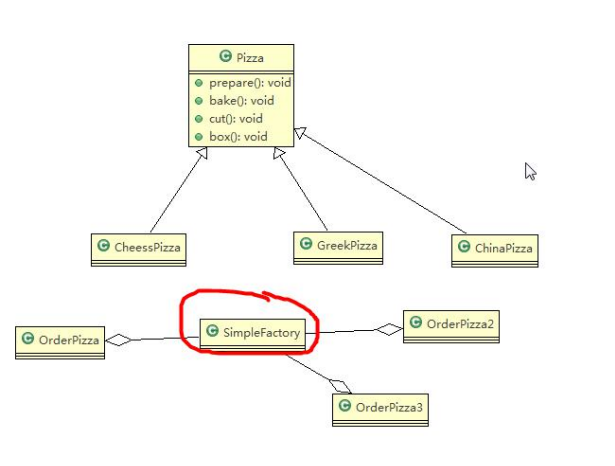
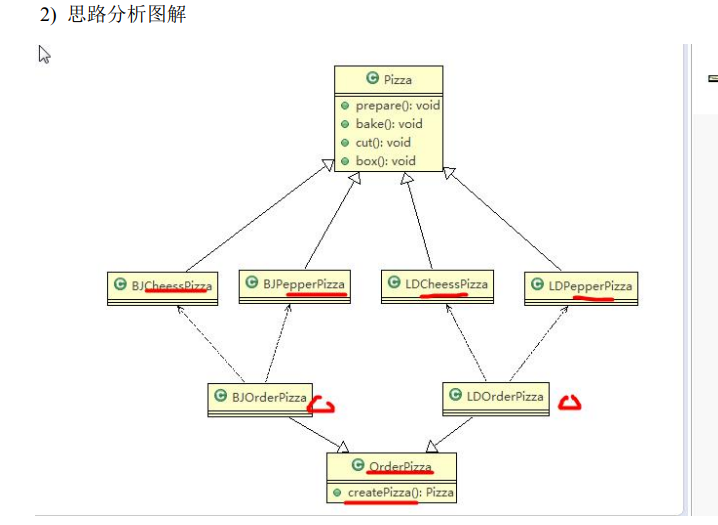
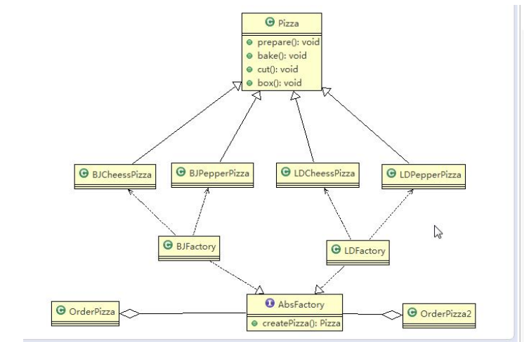

# 设计模式

## 七大原则

### 1.单一职责原则

> 对于类来说，即一个类应该只负责一项职责，如果类A负责两个不同的职责，当其中一个职责中需求变更时，可能会影响到另一个职责的执行，所以需要增加类A的颗粒度，按照职责分成两个类，来分担职责

### 2.接口隔离原则

> 客户端（需要使用某个接口的实现类方法的类）不应该依赖它不需要的接口（这里说的不需要是指接口中含有客户端不需要的方法），即一个类对另一个类的依赖应该建立在最小的接口上
>
> 
>
> 1. 现有类A，类B，类C，类D，接口interface，接口中含有三个方法为一二三
> 2. 类A需要使用到接口中的一二方法，类B需要使用接口中的一三方法
> 3. 类C，类D，均实现了interface接口
> 4. 类A只依赖了类C，类B只依赖了类D，（需要符合单一职责原则），此时，类C和类D均实现了本不需要实现的方法
> 5. 这里我们需要将接口拆分成三个接口，类C实现一二接口，类D实现一三接口

### 3.依赖倒转原则

> 1. 依赖倒转指的是高层模块不应该依赖底层模块，二者都应该依赖其抽象
> 2. 抽象不应该依赖细节，细节应该依赖抽象
> 3. 依赖倒转的中心思想是面向接口编程
> 4. 在java中抽象指的是接口或抽象类，细节就是具体的抽象类，相对于细节的多变性，抽象的更加稳定，
> 5. 使用抽象的接口或抽象类制定好规范，将细节操作交给实现类

### 4.里氏替换原则

>1. 在继承中，父类中已经实现好了的方法，一般实在设定规范，如果子类继承时，随意的修改父类中的方法，就会给程序带来侵略性
>2. 所有引用基类的地方必须能透明地使用其子类的对象
>3. 里氏替换原则就是在继承的时候尽量不要重写父类中的方法
>4. 继承使得两个类的耦合性增强，我们可以通过聚合，组合，依赖的方式来解决问题
>
>
>
>简单的理解为一个软件实体如果使用的是一个父类，那么一定适用于其子类，而且该软件实体不能察觉出父类对象与子类对象相同方法的区别，也就是说，软件实体中将父类都替换成它的子类，程序的行为没有变化
>
>
>
>里氏替换原则，在子类继承父类的方法和属性时，此时对程序是具有侵略性的，如果我们有一个类继承一个父类时，同时又有一个类（这里我们称为孙子类）继承了该子类，如果这个子类修改了父类中的方法，当我们使用孙子类调用最顶层的父类时，此时，孙子类不知道子类已经重写了父类的方法，就会导致程序出粗也就是程序的侵略性
>
>
>
>里氏替换原则一句话来说，当子类继承父类的属性和方法时，子类尽量不要重写父类的方法

### 5.开闭原则

> 一个软件实体类，模块和函数应该对扩展开发，对修改关闭，即当软件面对新需求时，需要变化，**尽量通过扩展软件实体（添加代码）的行为来实现变化，而不是通过修改已有的代码来实现变化**

### 6 .迪米特原则

> 1. 一个对象应该对其他对象保持最少的了解，因为，类与类的关系越密切，耦合度越大
> 2. 迪米特法则又叫最少知道原则，**即一个类对自己依赖的类知道的越少越好，也就是说对于被依赖的类，不管多复杂，都应该尽量将关于被依赖的类的操作封装到被依赖的类中**
> 3. 迪米特法则：只与直接朋友通信
> 4. 直接朋友：对象与对象直接的耦合关系中我们称成员变量，方法参数，方法返回值中的类称为直接朋友
> 5. 间接朋友：对象与对象的耦合关系中如果一个类出现在另一个类的局部变量中，此时我们称两个类为间接朋友 
> 6. **陌生的类最好不要以局部变量的形式出现在类的内部**

## 1.工厂模式-创建型

#### 1.1简单工厂模式

> 1. 简单工厂模式是由一个工厂对象决定创建出现哪一种产品类的实例
> 2. 简单工厂模式中定义了一个创建对象的类，由这个类来封装实例化代码的行为

#### 1.2工厂方法模式

> 1. 工厂方法模式将某个产品的实例化功能抽象成抽象方法，在不同的类型的子类中实现
> 2. 工厂方法模式定义了一个创建对象的抽象方法，由子类决定要实例化的类，工厂方法模式将对象的实例化推迟到子类

#### 1.3抽象工厂模式

> 1. 抽象工厂模式：定义了一个interface，用于创建相关或有依赖关系的对象，无需指明具体的类
> 2. 抽象工厂模式可以将简单工厂模式和工厂方法模式进行整合
> 3. 抽象工厂模式就是对简单工厂模式的改进和进一步抽象
> 4. 将工厂抽象成两层，AbsFactory（抽象工厂）和具体实现的工厂子类，程序员可以根据创建对象类型使用对应的工厂子类

