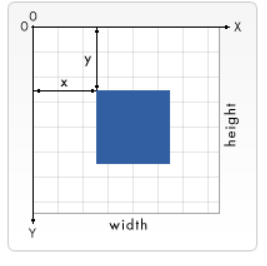

# H5 开发设计

**新特性**

1. H5 新增标签
   
   > HTML5 定了 8 个新的 HTML 语义（semantic） 元素。所有这些元素都是 块级 元素。为了能让旧版本的浏览器正确显示这些元素，你可以设置 CSS 的 display 属性值为 block（H5的某些标签，功能，在比较老旧的浏览器中无法正确解析执行）   

```html
header, section, footer, aside, nav, main, article, figure {
    display: block;
}
```

2. H5 自定义标签元素

> 在H5中可以自定义元素标签，如果直接写标签，此时标签是没有样式的（原本HTML中的标签的样式都是预先定义的）


## Canvas标签

> HTML5 <canvas> 元素用于图形的绘制，通过脚本 (通常是JavaScript)来完成.
>
> <canvas> 标签只是图形容器，您必须使用脚本来绘制图形。
>
> 你可以通过多种方法使用 canvas 绘制路径,盒、圆、字符以及添加图像。


### canvas元素

> `<canvas>` 看起来和 `` 标签一样，只是 `<canvas>` 只有两个可选的属性 `width、heigth` 属性，而没有 `src、alt` 属性。
>
> 如果不给 `<canvas>` 设置 `widht、height` 属性时，则默认 `width`为300、`height` 为 150，单位都是 `px`。也可以使用 `css` 属性来设置宽高，但是如宽高属性和初始比例不一致，他会出现扭曲。所以，建议永远不要使用 `css` 属性来设置 `<canvas>` 的宽高。


**注意，有些比较老的浏览器不能解析canvas标签**

```
// 若浏览器可以解析canvas标签，就会创建一个画布而忽略其中的内容，如果不能解析，就会展示标签中的内容
<canvas>
    你的浏览器不支持 canvas，请升级你的浏览器。
</canvas>
```

### 绘制形状

#### 1.栅格和坐标空间

> `canvas` 元素默认被网格所覆盖。通常来说网格中的一个单元相当于 `canvas` 元素中的一像素。栅格的起点为左上角，坐标为 (0,0) 所有元素的位置都相对于原点来定位。所以图中蓝色方形左上角的坐标为距离左边（X 轴）x 像素，距离上边（Y 轴）y 像素，坐标为 (x,y)。



#### 2.绘制矩形

`<canvas>` 只支持一种原生的图形绘制：**矩形**。所有其他图形都至少需要生成一种路径 (`path`)。不过，我们拥有众多路径生成的方法让复杂图形的绘制成为了可能。

canvast 提供了三种方法绘制矩形：

- 1、**fillRect(x, y, width, height)**：绘制一个填充的矩形。
- 2、**strokeRect(x, y, width, height)**：绘制一个矩形的边框。
- 3、**clearRect(x, y, widh, height)**：清除指定的矩形区域，然后这块区域会变的完全透明。

**说明：**这 3 个方法具有相同的参数。

- **x, y**：指的是矩形的左上角的坐标。(相对于canvas的坐标原点)
- **width, height**：指的是绘制的矩形的宽和高。


#### 3. 绘制路径

图形的基本元素是路径。

路径是通过不同颜色和宽度的线段或曲线相连形成的不同形状的点的集合。

一个路径，甚至一个子路径，都是闭合的。

使用路径绘制图形需要一些额外的步骤：

1. 创建路径起始点
2. 调用绘制方法去绘制出路径
3. 把路径封闭
4. 一旦路径生成，通过描边或填充路径区域来渲染图形。

**下面是需要用到的方法：**

1. `beginPath()`

   新建一条路径，路径一旦创建成功，图形绘制命令被指向到路径上生成路径

2. `moveTo(x, y)`

   把画笔移动到指定的坐标`(x, y)`。相当于设置路径的起始点坐标。

3. `closePath()`

   闭合路径之后，图形绘制命令又重新指向到上下文中

4. `stroke()`

   通过线条来绘制图形轮廓

5. `fill()`

   通过填充路径的内容区域生成实心的图形

**其他方法**

`ctx.lineTo(x, y)`

绘制一条从当前位置到指定坐标(200, 50)的直线.

  
