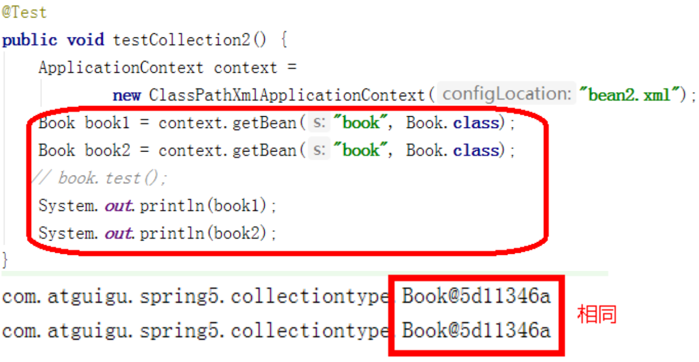
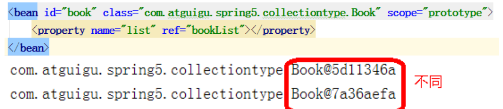

# Spring

> spring  是一个全面的企业应用开发一站式的解决方案

**特点**

1. 轻量级
2. 控制反转
3. AOP面向切面
4. IOC容器
5. 框架集合


## spring配置文件-bean.xml

**bean.xml**

```xml
```


### bean.xml测试

```java
@Test
public void testUser(){
    // 1. 加载spring配置文件
    ApplicationContext context = new ClassPathXmlApplicationContext("bean.xml");
    // 2. 获取配置并创建对象
    User user = Context.getBean("user",User.class);
    System.out.println(user);
    user.add();
}
```

## IOC

### bean创建过程

**IOC通过xml配置文件创建对象的过程**

1. 先通过bean.xml获取配置信息，之后通过工厂模式和反射机制创建对象


### IOC容器接口

> 1. IOC思想是基于IOC容器完成的，IOC容器底层就是对象工厂
> 2. Spring提供IOC容器两种实现方式（即两个接口）
>    1. BeanFactory：IOC容器的基本实现，是Spring框架内部使用的接口，不向外提供使用，**该方式属于懒加载模式，加载配置文件时不会创建对象，只有在获取对象时才会去创建对象**
>    2. ApplicationContext：该接口是BeanFactory接口的子接口，有更多更强大的功能，提供给开发人员使用，**使用该接口在加载配置文件时会创建配置文件中所有的对象，用于web开发阶段（提前将对象创建，节省时间，更好的用户体验）**

### IOC操作Bean

####  创建Bean

+ 普通创建对象方式

```java
Bean bean = new Bean();
```

+ 基于XML方式创建对象

  ```xml
  // 配置User对象
  <bean id="user" class="com.spring.pojo.User"></bean>
  <!-- 
  1. id:该对象的唯一标识，之后我们需要通过id值来获取创建的对象
  2. class: 该类的全路径，spring在底层中是通过传入的全路径和工厂模式加反射机制来创建对象的
  -->
  
  ```
  
  **创建对象时默认执行的是无参构造new出的对象**

```java
// 通过xml文件方式创建对象如何获取
	// 1.读取xml文件获取ApplicationContext对象
 	ApplicationContext context =   new ClassPathXmlApplicationContext("bean.xml");
    // 2. 获取配置并创建对象
    User user = Context.getBean("user",User.class);
```


#### 依赖注入

**这里的依赖注入就是创建对象时给对象的属性注入属性值**

##### 1.set注入

1. 创建类，定义属性和对应的 set 方法 

/** * 演示使用 set 方法进行注入属性 */ 

 ```java
 /**
 * 演示使用 set 方法进行注入属性
 */
 public class Book {
      //创建属性
      private String bname;
      private String bauthor;
      //创建属性对应的 set 方法 ，通过set进行依赖注入，必须要写set方法
      public void setBname(String bname) {
          this.bname = bname;
      }
      public void setBauthor(String bauthor) {
         this.bauthor = bauthor;
      }
 }
 ```


2. 在 spring 配置文件配置对象创建，配置属性注入    **(property)**

```xml
<!--2 set 方法注入属性-->
<bean id="book" class="com.atguigu.spring5.Book">
     <!--使用 property 完成属性注入
     name：类里面属性名称
     value：向属性注入的值
     -->
     <property name="bname" value="易筋经"></property>
     <property name="bauthor" value="达摩老祖"></property>
</bean>

```

##### 2.有参构造注入

1. 创建Orders类时通过有参构造注入属性值时需要添加有参构造函数

```java
public class Orders {
 	//属性
     private String oname;
     private String address;
     //有参数构造，通过有参构造注入时，必须要有有参构造函数
     public Orders(String oname,String address) {
        this.oname = oname;
        this.address = address;
     }
}
```

2. 在Spring的bean.xml文件中进行配置**（constructor-arg）**

```xml
<bean id="orders" class="com.atguigu.spring5.Orders">
     <constructor-arg name="oname" value="电脑"></constructor-arg>
     <constructor-arg name="address" value="China"></constructor-arg>
</bean>

```

#### 其他类型的依赖注入

##### 1. 字面量

1. 给属性注入**null**值

```xml
<!-- 这里是通过property进行set方法注入null值-->
<property name="address">
	 <null/>
</property>
```

2. 给属性注入特殊字符

```xml
（2）属性值包含特殊符号
    <!--属性值包含特殊符号
     1 把<>进行转义 &lt; &gt;
     2 把带特殊符号内容写到 CDATA
    -->
<property name="address">
 	<value><![CDATA[<<南京>>]]></value>
</property>
```

##### 2.注入外部bean

> 当service类中的属性有dao类，并调用dao类中的方法
>
> 1. 通过bean标签创建dao对象实例
> 2. 在创建service对象实例时，通过set方法和ref属性，将创建好的dao对象实例注入到service对象实例的属性中

```xml
<!--1 service 和 dao 对象创建-->
<bean id="userDaoImpl" class="com.atguigu.spring5.dao.UserDaoImpl"></bean>

 
<bean id="userService" class="com.atguigu.spring5.service.UserService">
     <!--注入 userDao 对象
     name 属性：类里面属性名称
     ref 属性：创建 userDao 对象 bean 标签 id 值
     -->
     <property name="userDao" ref="userDaoImpl"></property>
    </bean>

```

##### 3.注入内部bean

```xml
<!--内部 bean-->
<bean id="emp" class="com.atguigu.spring5.bean.Emp">
     <!--设置两个普通属性-->
     <property name="ename" value="lucy"></property>
     <property name="gender" value="女"></property>
     <!--设置对象类型属性 直接在属性property标签中创建属性类型的bean-->
     <property name="dept">
         <bean id="dept" class="com.atguigu.spring5.bean.Dept">
         	<property name="dname" value="安保部"></property>
         </bean>
     </property>
</bean>
```

##### 4.注入集合属性

**基本数据类型和String类型**

````xml
<!--1 集合类型属性注入-->
<bean id="stu" class="com.atguigu.spring5.collectiontype.Stu">
	 <!--数组类型属性注入-->
 	<property name="courses">
 		<array>
 			<value>java 课程</value>
 			<value>数据库课程</value>
 		</array>
 	</property>
    
 <!--2. list 类型属性注入-->
 	<property name="list">
 		<list>
 			<value>张三</value>
 			<value>小三</value>
 		</list>
 	</property>
    
 <!--3. map 类型属性注入-->
 	<property name="maps">
 		<map>
 			<entry key="JAVA" value="java"></entry>
 			<entry key="PHP" value="php"></entry>
 		</map>
 	</property>
 <!--4. set 类型属性注入-->
 	<property name="sets">
 		<set>
 			<value>MySQL</value>
 			<value>Redis</value>
 		</set>
 	</property>
</bean>
````

**对象类型依赖注入**

> 先创建多个对象实例，之后将这些对象实例通过ref标签注入到属性中

```xml
<!--创建多个 course 对象-->
<bean id="course1" class="com.atguigu.spring5.collectiontype.Course">
 	<property name="cname" value="Spring5 框架"></property>
</bean>
<bean id="course2" class="com.atguigu.spring5.collectiontype.Course">
 	<property name="cname" value="MyBatis 框架"></property>
</bean>


<!--注入 list 集合类型，值是对象-->
<property name="courseList">
 	<list>
 		<ref bean="course1"></ref>
 		<ref bean="course2"></ref>
 	</list>
</property>

```

### Bean管理

1. Spring 有两种类型 bean，一种普通 bean，另外一种工厂 bean（FactoryBean）
2. 普通 bean：在配置文件中定义 bean 类型就是返回类型
3. 工厂 bean：在配置文件定义 bean 类型可以和返回类型不一样

```java
// 工厂Bean实现方式


第一步 创建类，让这个类作为工厂 bean，实现接口 FactoryBean
第二步 实现接口里面的方法，在实现的方法中定义返回的 bean 类型
public class MyBean implements FactoryBean<Course> {
 //定义返回 bean
 @Override
 public Course getObject() throws Exception {
 	Course course = new Course();
 	course.setCname("abc");
 	return course;
 }
 @Override
 public Class<?> getObjectType() {
 	return null;
 }
 @Override
 public boolean isSingleton() {// 设置是否为单例模式
 	return false;
 }
}
<bean id="myBean" class="com.atguigu.spring5.factorybean.MyBean">
</bean>
    
    
@Test
public void test3() {
 	ApplicationContext context = new ClassPathXmlApplicationContext("bean3.xml");
 	Course course = context.getBean("myBean", Course.class);
 	System.out.println(course);
}

```

### Bean的作用域

> 这里的Bean的作用域指的是单例模式还是多例模式，即当程序需要多次访问莫格对象实例时，spring返回的是同一个bean，还是会重新创建一个bean并返回

**在默认情况下spring中的Bean是单例模式，即访问时返回的都是同一个bean**




**设置Spring中Bean的单例模式和多例模式**

1. 在 spring 配置文件 bean 标签里面有属性（scope）用于设置单实例还是多实例 
2. scope 属性值 第一个值 默认值，singleton，表示是单实例对象 
3. 第二个值 prototype，表示是多实例对象




>  **singleton 和 prototype 区别 **
>
> 1. 第一 singleton 单实例，prototype 多实例 
> 2. 第二 设置 scope 值是 singleton 时候，加载 spring 配置文件时候就会创建单实例对象 设置 scope 值是 prototype 时候，不是在加载 spring 配置文件时候创建 对象，而是在调用 getBean 方法时候创建多实例对象

### Bean的生命周期

所谓后置处理器其实是BeanPostProcessor的直译，前置和后置增强都是用BeanPostProcessor来实现的
