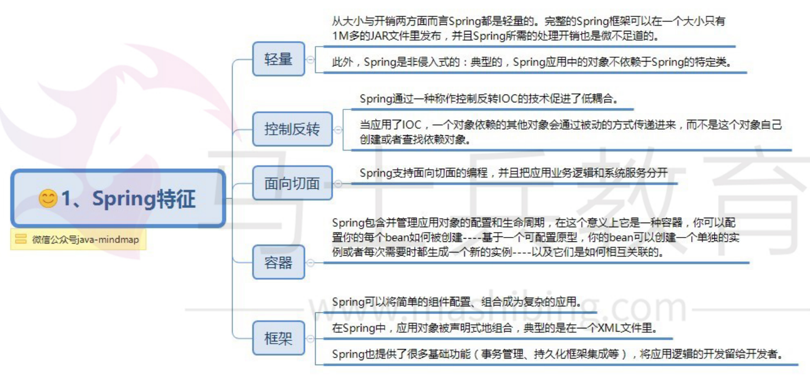
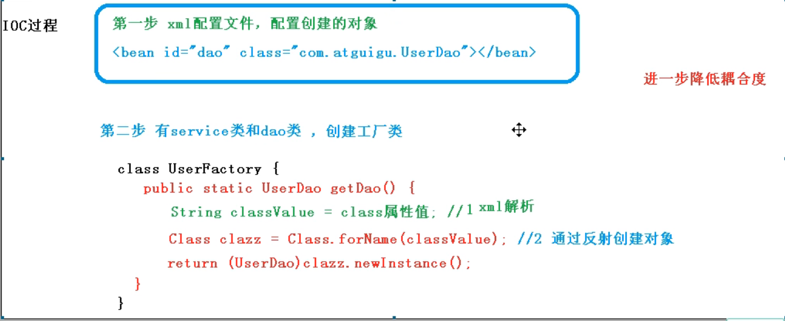

# Spring

> spring  是一个全面的企业应用开发一站式的解决方案

**特点**

1. 轻量级
2. 控制反转
3. AOP面向切面
4. IOC容器
5. 框架集合




## spring配置文件-bean.xml

**bean.xml**

```xml
```


### bean.xml测试

```java
@Test
public void testUser(){
    // 1. 加载spring配置文件
    ApplicationContext context = new ClassPathXmlApplicationContext("bean.xml");
    // 2. 获取配置并创建对象
    User user = Context.getBean("user",User.class);
    System.out.println(user);
    user.add();
}
```

## IOC

### ioc过程




### ioc接口

> 1. IOC思想是基于IOC容器完成的，IOC容器底层就是对象工厂
> 2. Spring提供IOC容器两种实现方式（即两个接口）
>    1. BeanFactory：IOC容器的基本实现，是Spring框架内部使用的接口，不向外提供使用，**该方式属于懒加载模式，加载配置文件时不会创建对象，只有在获取对象时才会去创建对象**
>    2. ApplicationContext：该接口是BeanFactory接口的子接口，有更多更强大的功能，提供给开发人员使用，**使用该接口在加载配置文件时会创建配置文件中所有的对象，用于web开发阶段（提前将对象创建，节省时间，更好的用户体验）**

### ioc操作Bean

####  创建Bean

+ 基于XML方式创建对象

  ```
  // 配置User对象
  <bean id="user" class="com.spring.pojo.User"></bean>
  在Spring配置文件中，使用bean标签，标签中添加相应的属性就可以s
  ```

  

#### 注入属性值

