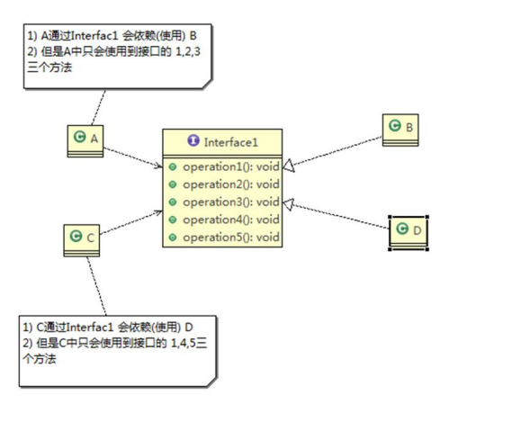
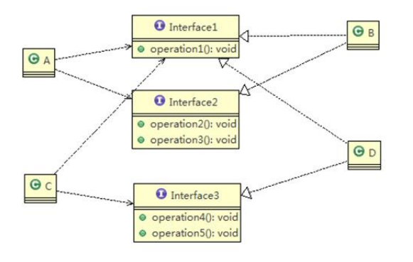

# 设计模式

## 设计模式七大原则

1. 单一职责原则
2. 接口隔离原则
3. 依赖倒转（倒置）原则
4. 里氏替换原则
5. 开闭原则
6. 迪米特法则
7. 合成服用原则

### 1.单一职责原则

> 1. 降低类的复杂度，**一个类只负责一项职责**
> 2. 提高类的可读性，可维护性
> 3. 降低变更引起的风险
> 4. 通常情况下我们需要遵守单一职责原则，但是如果类中的方法数量足够少，可以在方法级别上保持单一职责原则

### 2.接口隔离原则

> **客户端不应该依赖它不需要的接口，即一个类对另一个类的依赖应该建立在最小接口上**
>
> 处理：
>
> ​		将一个含有多个方法的接口拆成独立的几个接口，类A和类C分别继承各自需要的接口即可，这就是接口隔离原则
>
> ​		**理解成接口级别的单一职责**

类A通过接口interface1依赖B类，类C通过接口interface1依赖了D类，因为接口interface1中对于A类和C类有不需要的方法，但是A类依赖的B类，C类依赖的D类又不得不去实现他们本不需要实现的方法，违背了接口隔离原则

**这里将接口1根据类A和类C方法的依赖拆解成三个接口，通过类对接口的多继承来实现，达到接口隔离的效果**

### 3.依赖倒转原则

