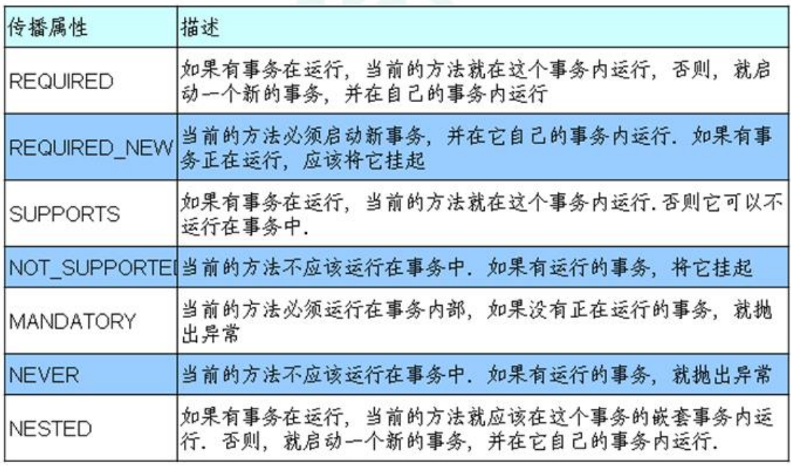
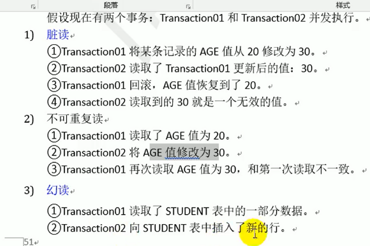
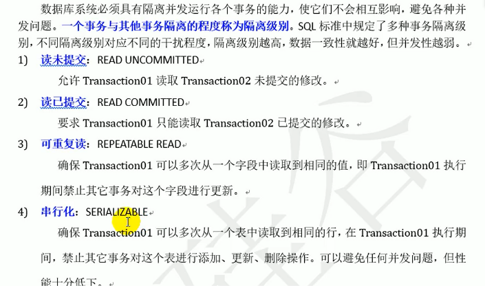
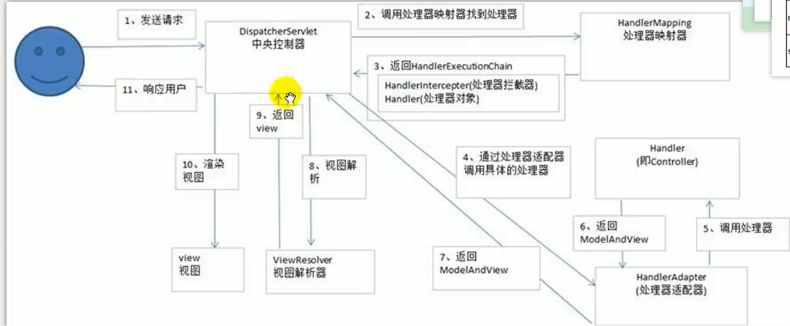
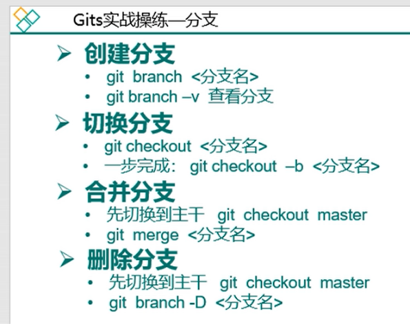
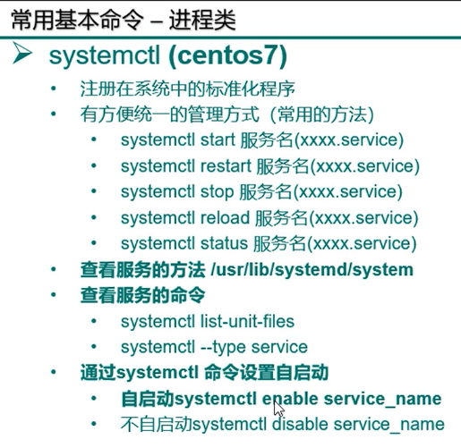

# Java面试

## JavaSE

### 1. JDK和JRE有什么区别

> **JDK**:Java Development kit 简称为java开发工具包,提供了java的开发环境和运行环境

> **JRE**: Java RunTime Environment 简称为java 运行环境,为java运行提供了所需环境

注: 如果只是运行java程序只需要JRE,如果想要开发java程序就需要安装JDK

## Spring

### 1.Spring Bean 的作用域

> 在Spring 中的作用域可以通过scope属性来指定Bean的作用域

+ **singleton**: 作为Spring Bean 作用域的默认值,当IOC容器创建时,就会创建该Bean的实例,并且,在Spring使用哦该Bean 的时候,返回的都是同一个,**这里使用的单例模式**

+ **prototype**: 当IOC容器创建时,并不会创建这个Bean的实例,而是在每次调用getBean方法的时候实例化该Bean,而且每调用一次都会实例化一次该Bean,所以这里多次得到的都是不同的Bean
+ **request**: 每次请求都会实例化该Bean,也就是说,同一个request中使用的是同一个Bean实例,不同则使用的不是同一个Bean实例,但仅仅适用于WebApplicationContext中
+ **Session**: 每次Session会话都会实例化该Bean,也就是说,同一个Session会话 中使用的是同一个Bean实例,不同则使用的不是同一个Bean实例,但仅仅适用于WebApplicationContext中

### 2.Spring中的事务传播和事务隔离级别

**常见的事务传播属性**

> Spring 中通过@Transactional注解控制事务,propagation属性来设置事务传播行为,isolation属性设置事务的隔离级别

事务的传播行为: 一个方法运行在另一个开启了事务的方法中,当前方法是使用原来的事务还是开启一个新的事务

		1. Propagation.REQUIRED:  作为默认值,使用原来方法中的事务
		1. Propagation.REQUIRES_NEW: 将原有的事务挂起,开启一个新的事务

**事务的隔离级别**

### 3.SpringMVC中如何解决POST请求中文乱码问题,GET请求如何解决

### 4.SpringMVC的工作流程

## Mybatis

###  1.Mybatis中实体类中的属性名和表中的字段名不同

**解决方案**

1. 在书写SQL语句时给字段名起别名
2. 在Mybatis的全局配置中设置驼峰命名
3. 在Mapper.xml映射文件中使用resultMap来自定义映射规则

## Git

## Linux

### Linux中进程相关的命令

## Redis

### redis持久化

## MySql

### MySql什么时候建索引

## JVM

### JVM中垃圾回收机制
